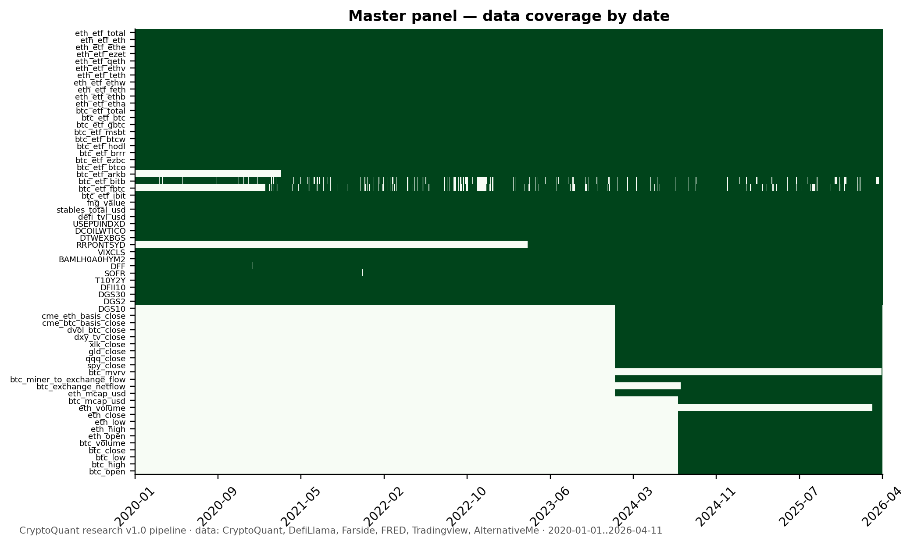
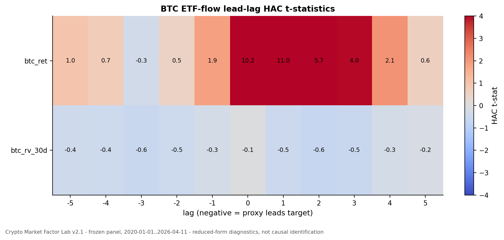
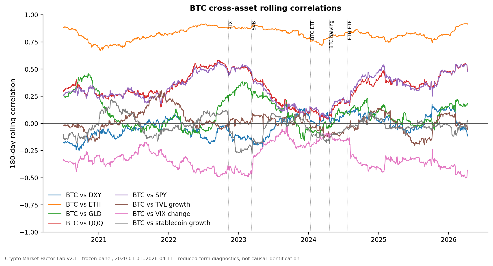

# Crypto Market Factor Lab

> A reproducible Python research framework for BTC/ETH factor regimes, ETF-flow
> market plumbing, stablecoin liquidity, cross-asset connectedness, and
> crypto-native market structure using a frozen multi-source panel through
> April 2026.

This repository is positioned as a portfolio-grade crypto factor analytics
system built around frozen data and reproducible release pipelines. Curated
crypto, macro, ETF-flow, stablecoin, DeFi, and on-chain data are transformed
into tables, figures, model cards, and GitHub-ready release packets.

## First 60 Seconds

- **What it is:** a Python quant research lab for BTC/ETH factor diagnostics.
- **What it demonstrates:** data engineering, econometrics, market-structure
  reasoning, reproducible research, and careful visual communication.
- **What it does not claim:** causal proof that ETFs caused a structural break.
  ETF-flow results are framed as association, exposure, lead-lag evidence, and
  market-plumbing diagnostics.
- **Where to start:** run `uv run python scripts/run_portfolio_v2_1_pipeline.py` and
  open [`reports/portfolio_v2_1/executive_summary.md`](reports/portfolio_v2_1/executive_summary.md).
- **Advanced extension:** v2.2 adds PCA, exact block Shapley R2, CUSUM,
  FEVD-order sensitivity, rolling connectedness, and robustness-grid diagnostics
  under [`reports/portfolio_v2_2/`](reports/portfolio_v2_2/).
- **GitHub review layer:** start with
  [`reports/artifact_index.md`](reports/artifact_index.md),
  [`reports/portfolio_showcase/README_SHOWCASE.md`](reports/portfolio_showcase/README_SHOWCASE.md),
  and [`reports/portfolio_showcase/figure_gallery.md`](reports/portfolio_showcase/figure_gallery.md).

## Quick Start

```powershell
uv sync --all-extras
uv run pytest
uv run python scripts/run_portfolio_v2_1_pipeline.py
uv run python scripts/run_portfolio_v2_2_pipeline.py
```

For the historical research pipeline:

```powershell
uv run python scripts/run_full_pipeline.py
```

Data ingestion can require API keys and source availability. The portfolio
release uses the frozen dataset already committed under `Data/` and does not
require paid data.

## Repository Map

| Folder | Purpose |
|---|---|
| `Data/` | Frozen curated CSV data, documented by `Data/MASTER_DATA.md` and `Data/MASTER_DATA.csv`. |
| `config/` | Calendars, events, factor blocks, curation snapshots, and path constants. |
| `src/cqresearch/` | Reusable package for data loading, feature construction, modeling, and visualization helpers. |
| `scripts/` | Reproducible orchestration scripts, including `run_portfolio_pipeline.py`, `run_portfolio_v2_1_pipeline.py`, and `run_portfolio_v2_2_pipeline.py`. |
| `reports/panels/` | Frozen master panel metadata and generated parquet panels. |
| `reports/tables/` | Dated model and robustness outputs. |
| `reports/figures/` | Dated visual outputs from the analysis pipeline. |
| `reports/portfolio_v2/` | Stable baseline portfolio packet. |
| `reports/portfolio_v2_1/` | Main polished analytics packet with block partial R^2, ablations, lead-lag labs, rolling correlations, stablecoin liquidity, native factors, figures, reports, model cards, and manifest. |
| `reports/portfolio_v2_2/` | Advanced diagnostics extension with PCA blocks, exact block Shapley R2, CUSUM, FEVD-order sensitivity, rolling connectedness, robustness grid, reports, model cards, and manifest. |
| `reports/portfolio_showcase/` | GitHub-facing showcase, figure gallery, project walkthrough, and reviewer navigation docs. |
| `reports/optional_data/` | Optional free-data extension notes and source decision table. |
| `optional_data/` | Optional source scaffolding docs; not required for core reproduction. |
| `docs/specs/` | Research, data, methods, feature, and portfolio specifications. |
| `tests/` | Unit tests for config, fixtures, imports, and portfolio pipeline helpers. |

## Portfolio Releases

## Core Modules

- Frozen multi-source panel construction and feature engineering.
- HAC OLS, block partial R2, ablation, lead-lag, rolling correlation, VAR/FEVD,
  event-study, PCA, Shapley R2, CUSUM, and robustness diagnostics.
- Artifact orchestration through portfolio release scripts, manifests, model
  cards, and verification diagnostics.

### v2.1 Main Release

The v2.1 pipeline uses the frozen panel, writes a separate enhanced packet under
`reports/portfolio_v2_1/`, and leaves `Data/` untouched.

```powershell
uv run python scripts/run_portfolio_v2_1_pipeline.py
```

Expected outputs:

- [`reports/portfolio_v2_1/executive_summary.md`](reports/portfolio_v2_1/executive_summary.md)
- [`reports/portfolio_v2_1/technical_report.md`](reports/portfolio_v2_1/technical_report.md)
- [`reports/portfolio_v2_1/analytics_summary.md`](reports/portfolio_v2_1/analytics_summary.md)
- [`reports/portfolio_v2_1/data_atlas.md`](reports/portfolio_v2_1/data_atlas.md)
- [`reports/portfolio_v2_1/model_cards/`](reports/portfolio_v2_1/model_cards/)
- [`reports/portfolio_v2_1/figures/`](reports/portfolio_v2_1/figures/)
- [`reports/portfolio_v2_1/tables/`](reports/portfolio_v2_1/tables/)
- [`reports/portfolio_v2_1/manifest.json`](reports/portfolio_v2_1/manifest.json)

### What v2.1 Adds

v2.1 adds the main public analytics layer: block partial R2, BTC/ETH ablations,
ETF-flow lead-lag diagnostics, rolling cross-asset correlations, stablecoin
liquidity proxy analysis, BTC-native factor diagnostics, model cards, and a
public report packet.

### v2.2 Advanced Diagnostics

v2.2 is an extension packet, not a replacement for the v2.1 public portfolio
release. It adds advanced diagnostics under `reports/portfolio_v2_2/` and
keeps all outputs reduced-form.

```powershell
uv run python scripts/run_portfolio_v2_2_pipeline.py
```

Key outputs:

- [`reports/portfolio_v2_2/executive_summary.md`](reports/portfolio_v2_2/executive_summary.md)
- [`reports/portfolio_v2_2/technical_report.md`](reports/portfolio_v2_2/technical_report.md)
- [`reports/portfolio_v2_2/advanced_methods_summary.md`](reports/portfolio_v2_2/advanced_methods_summary.md)
- [`reports/portfolio_v2_2/data_atlas.md`](reports/portfolio_v2_2/data_atlas.md)
- [`reports/portfolio_v2_2/model_cards/`](reports/portfolio_v2_2/model_cards/)
- [`reports/portfolio_v2_2/figures/`](reports/portfolio_v2_2/figures/)
- [`reports/portfolio_v2_2/tables/`](reports/portfolio_v2_2/tables/)
- [`reports/portfolio_v2_2/manifest.json`](reports/portfolio_v2_2/manifest.json)

### Public Showcase

Showcase outputs:

- [`reports/portfolio_showcase/README_SHOWCASE.md`](reports/portfolio_showcase/README_SHOWCASE.md)
- [`reports/portfolio_showcase/project_walkthrough.md`](reports/portfolio_showcase/project_walkthrough.md)
- [`reports/portfolio_showcase/figure_gallery.md`](reports/portfolio_showcase/figure_gallery.md)
- [`reports/portfolio_showcase/quant_research_summary.md`](reports/portfolio_showcase/quant_research_summary.md)
- [`reports/portfolio_showcase/crypto_research_summary.md`](reports/portfolio_showcase/crypto_research_summary.md)
- [`reports/portfolio_showcase/data_engineering_summary.md`](reports/portfolio_showcase/data_engineering_summary.md)
- [`reports/portfolio_showcase/quant_dev_summary.md`](reports/portfolio_showcase/quant_dev_summary.md)

## Hero Figures

### Data Architecture And Coverage



### Factor Attribution


### ETF Flow Market Plumbing



### Cross-Asset Regimes



### Stablecoin Liquidity And Native Factors

- [Stablecoin supply and TVL](reports/portfolio_v2_1/figures/F40_stablecoin_supply_and_tvl.png)
- [BTC native z-score dashboard](reports/portfolio_v2_1/figures/F50_btc_native_zscore_dashboard.png)

### Advanced Diagnostics

- [PCA factor trajectories](reports/portfolio_v2_2/figures/F71_pca_factor_trajectories.png)
- [BTC rolling exact Shapley R2](reports/portfolio_v2_2/figures/F72_btc_shapley_r2_stack.png)
- [ETH rolling exact Shapley R2](reports/portfolio_v2_2/figures/F73_eth_shapley_r2_stack.png)
- [Rolling VAR/FEVD connectedness](reports/portfolio_v2_2/figures/F77_rolling_connectedness.png)
- [BTC robustness grid](reports/portfolio_v2_2/figures/F78_robustness_grid_heatmap.png)

### Connectedness And Events

- [Compact VAR/FEVD connectedness heatmap](reports/portfolio_v2_1/figures/F60_baseline_fevd_compact_heatmap.png)
- [Event-study CARs](reports/portfolio_v2_1/figures/F61_baseline_event_study_cars.png)

## Review Discussion Points

- Why full-vs-reduced block partial R^2 is useful, and why it is not
  Shapley/Owen attribution.
- Why ETF-flow intensity is market-plumbing evidence rather than causal proof.
- How stablecoin supply and TVL can be used as liquidity proxies without
  overselling them as identified shocks.
- Why MVRV is separated from non-MVRV BTC-native variables.
- How the codebase would be productionized for a research desk.

## Key Technical Skills Demonstrated

Python data engineering, reproducible artifact pipelines, stationary feature
engineering, HAC OLS, block attribution, lead-lag regressions, rolling
correlations, realized volatility, PCA, exact block Shapley R2, compact VAR/FEVD
diagnostics, model cards, and public-facing quant communication.

## What This Demonstrates By Role

- Quant research: reduced-form factor diagnostics, attribution, robustness, and
  regime analysis.
- Crypto research: ETF-flow plumbing, stablecoin/TVL liquidity proxies, and
  BTC-native valuation/flow-state variables.
- Data engineering: multi-source curation, frozen panels, manifests, and tested
  release pipelines.
- Quant development: modular Python package design, one-command pipelines, CI,
  model cards, and reproducible artifacts.

## Artifact Index

Start at [`reports/artifact_index.md`](reports/artifact_index.md) for a compact
map of the release packets, figures, tables, model cards, showcase docs, and
verification artifacts.

## Release Candidate Docs

- [`reports/final_public_readiness_audit.md`](reports/final_public_readiness_audit.md)
- [`reports/pr_summary_portfolio_v2.md`](reports/pr_summary_portfolio_v2.md)
- [`reports/pr_review_package.md`](reports/pr_review_package.md)
- [`reports/release_notes_portfolio_v2.md`](reports/release_notes_portfolio_v2.md)

## Data Refresh

The frozen portfolio release does not need a refresh. If you intentionally want
to rebuild source data, use the curation tools and review `Data/_meta/curation_log.md`.

```powershell
make ingest
make curate
make inventory
make validate
```

## Optional Free-Data Extensions

The optional data layer is scaffolding only. It adds URL builders, payload
normalizers, offline scripts, tests, and source decision notes for DefiLlama,
CoinGecko, Binance public klines, and FRED. It is not required by v2.1 or v2.2.

- [`optional_data/README.md`](optional_data/README.md)
- [`reports/optional_data/free_data_addon_plan.md`](reports/optional_data/free_data_addon_plan.md)
- [`reports/optional_data/source_decision_table.md`](reports/optional_data/source_decision_table.md)
- `uv run pytest tests/unit/test_optional_data_sources.py`

## Limitations

- Daily data cannot identify intraday mechanisms or trade-level liquidity.
- ETF-flow, stablecoin, and native-factor outputs are reduced-form diagnostics,
  not causal identification.
- CUSUM is exploratory and does not replace full multi-break estimation.
- v2.2 Shapley R2 depends on block definitions and the selected feature set.
- Optional live/free data should be cache-versioned before becoming part of any
  reproducible release.

## Method Notes

- Baseline and v2.1 rolling attribution is **drop-one marginal R^2**, not
  Shapley/Owen.
- v2.2 implements and labels **exact block Shapley R2** separately; it is still
  predictive attribution, not causal proof.
- Structural break diagnostics are **Chow tests and single-break sup-F sweeps**,
  not a full Bai-Perron multiple-break estimator.
- ETF-flow intensity is scaled as daily USD ETF flow divided by prior-day USD
  market capitalization.
- Reports should use language such as association, exposure, factor
  contribution, market plumbing, lead-lag evidence, and regime diagnostics.

## License

See `LICENSE` if present; otherwise code under `src/cqresearch/` defaults to MIT
per the original project metadata. External datasets and third-party references
retain their upstream terms.
