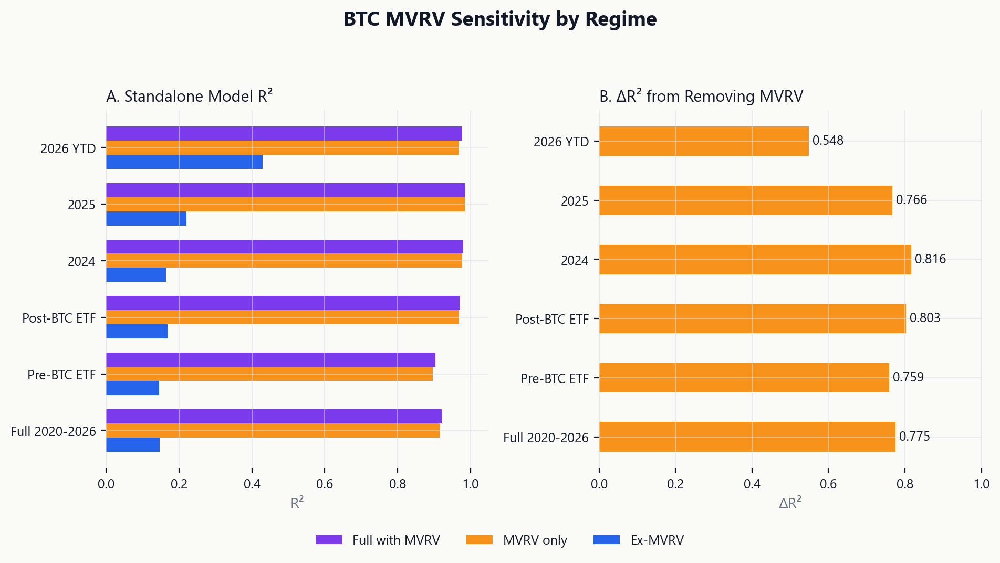
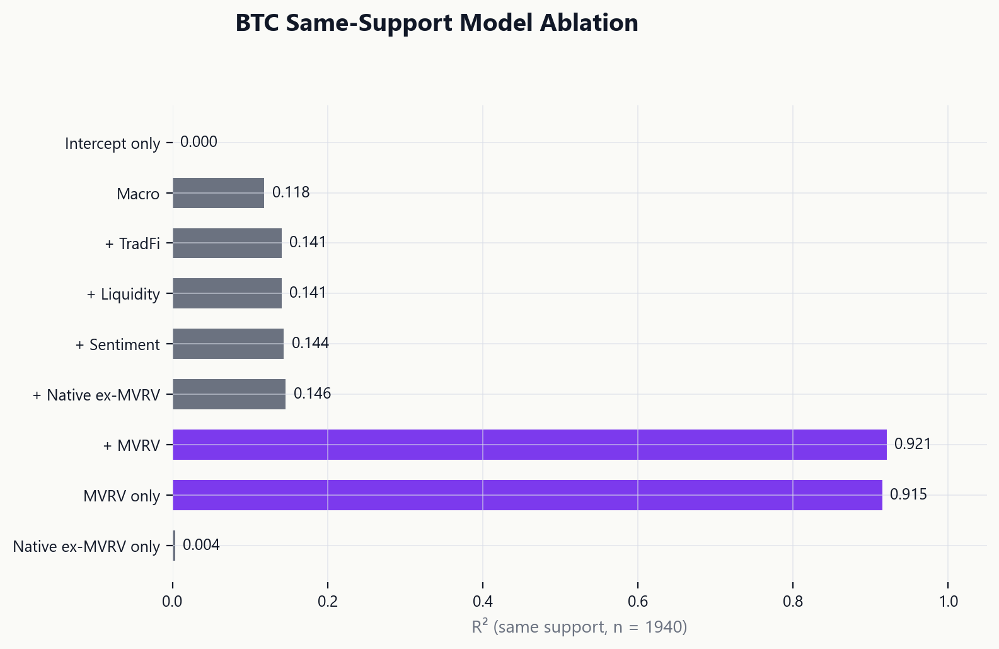
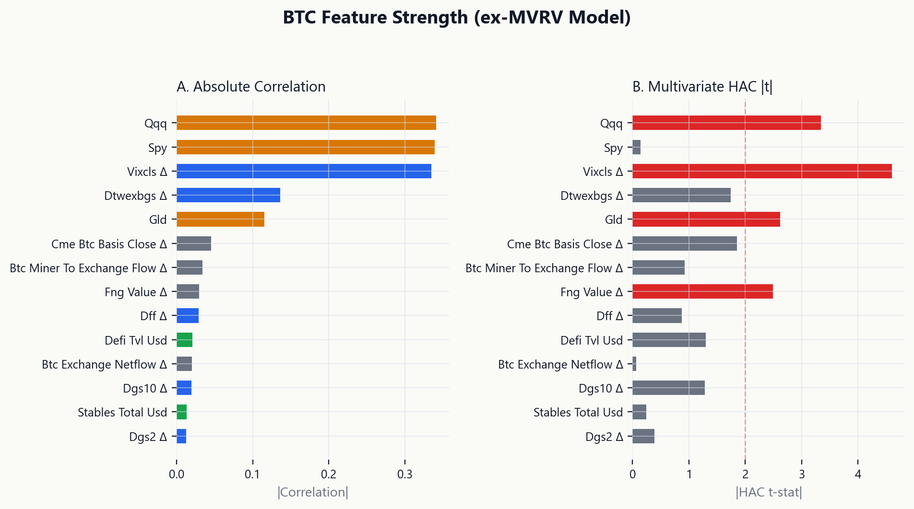
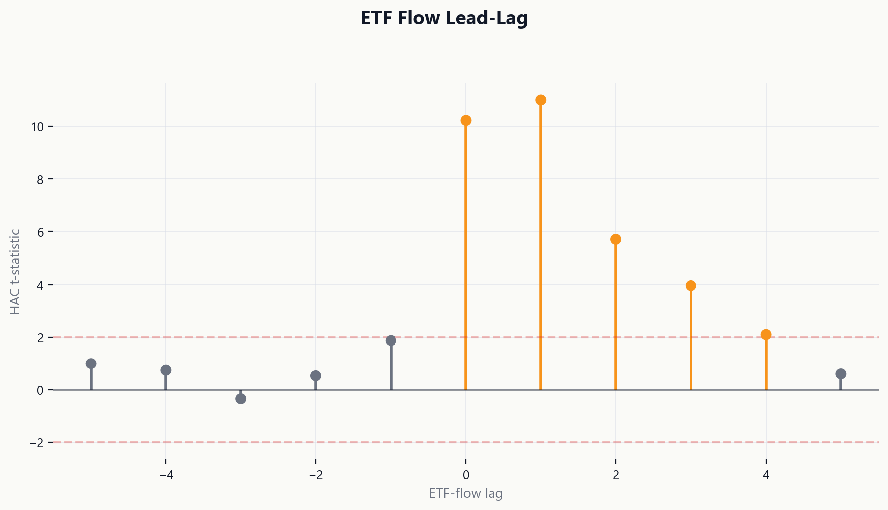
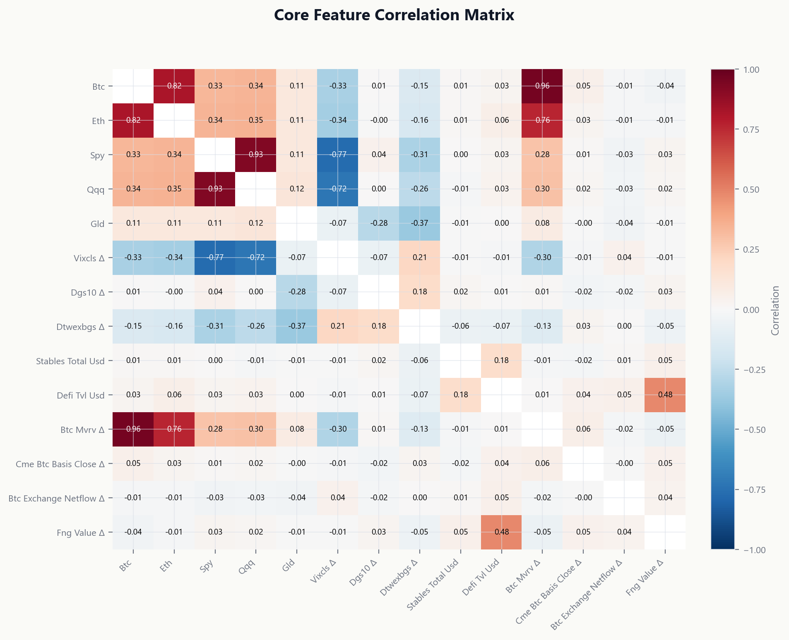
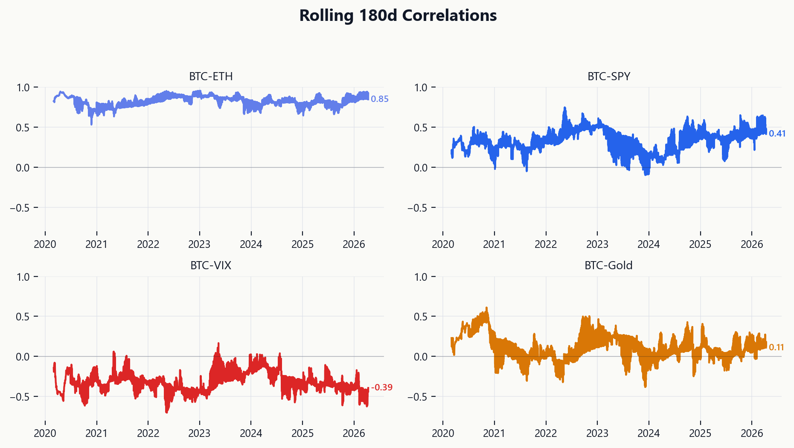
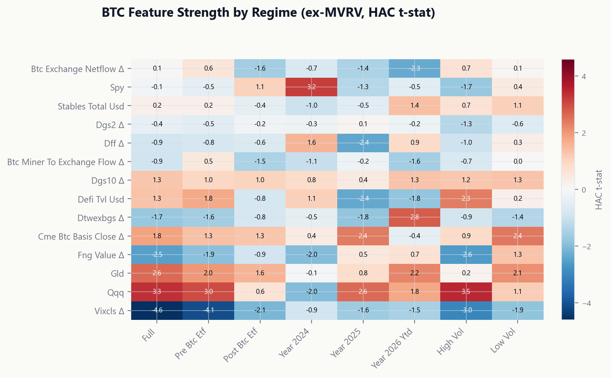
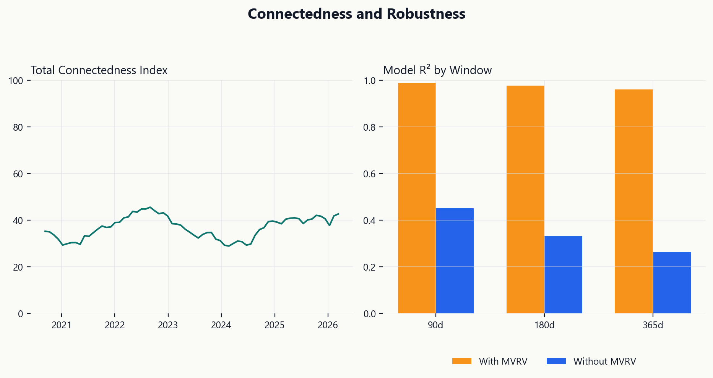
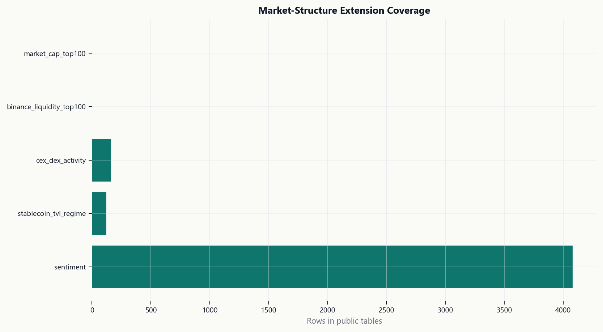

# Crypto Market Factor Lab

> A reproducible Python analytics system for BTC/ETH factor regimes, ETF-flow
> market plumbing, stablecoin liquidity, cross-asset connectedness, and
> crypto-native market structure using a frozen 2020–2026 multi-source panel.

## Results at a Glance

BTC daily-return models are extremely sensitive to MVRV-style valuation state.
In the current daily linear setup, `btc_mvrv_d1` has correlation ≈ 0.955 with
`btc_ret`, and removing MVRV from the full model drops R² from 0.921 to 0.146.
This is not surprising — MVRV is a close proxy for price-level variation — but
it dominates all other blocks by an order of magnitude.

We report both full and ex-MVRV models because MVRV is a valuation-state
variable highly correlated with BTC returns, not a clean exogenous factor.

| Diagnostic | Value | Source |
|---|---:|---|
| BTC full-model R² | 0.921 | [T03](outputs/tables/T03_block_attribution.csv) |
| BTC R² without MVRV | 0.146 | [T03](outputs/tables/T03_block_attribution.csv) |
| BTC MVRV-only standalone R² | 0.915 | [T19](outputs/tables/T19_same_support_ablation_btc.csv) |
| BTC native-ex-MVRV standalone R² | 0.004 | [T19](outputs/tables/T19_same_support_ablation_btc.csv) |
| BTC–MVRV correlation | 0.955 | [T21](outputs/tables/T21_top_correlations_btc.csv) |
| ETF-flow lag 0 HAC t-stat | 10.22 | [T04](outputs/tables/T04_etf_lead_lag.csv) |
| BTC Chow test p-value (ETF date) | 0.624 | [T08](outputs/tables/T08_structural_breaks.csv) |
| Mean VAR connectedness index | 39.3% | [T09](outputs/tables/T09_rolling_connectedness.csv) |

ETF-flow intensity has strong same-day association with BTC returns
(lag 0 t = 10.22), but daily data cannot identify causal flow impact. The
evidence is framed as market-plumbing and lead-lag diagnostics.

Non-MVRV native variables, macro, TradFi, and liquidity blocks each contribute
ΔR² < 0.01 in the full model. In the ex-MVRV specification, macro and TradFi
blocks become the largest contributors, but ex-MVRV model R² remains low
(~0.15).

### MVRV Dominance Across Regimes

MVRV dominance persists across all time windows but varies in magnitude:

| Regime | Full R² | Ex-MVRV R² | MVRV-only R² | ΔR² |
|---|---:|---:|---:|---:|
| Full 2020–2026 | 0.921 | 0.146 | 0.915 | 0.775 |
| Pre-BTC ETF | 0.904 | 0.146 | 0.897 | 0.759 |
| Post-BTC ETF | 0.971 | 0.168 | 0.968 | 0.803 |
| 2024 | 0.980 | 0.164 | 0.978 | 0.816 |
| 2025 | 0.987 | 0.220 | 0.985 | 0.766 |
| 2026 YTD | 0.978 | 0.429 | 0.967 | 0.549 |

Source: [T25_mvrv_sensitivity_by_regime.csv](outputs/tables/T25_mvrv_sensitivity_by_regime.csv) — all models on same-support samples.

The trend shows weakening MVRV dominance in 2026 YTD (ΔR² = 0.549) as
ex-MVRV factors gain explanatory power (R² = 0.429). This could reflect
changing market structure post-ETF institutionalization or sample-size effects
in a short window.

## Data

The public artifact packet uses a frozen daily panel from 2020-01-01 through
2026-04-11 with 2,293 rows and 63 columns. Frozen data keeps the project
reproducible without paid data, live API calls, or source refresh drift.

| Source | Role |
|---|---|
| CryptoQuant | BTC/ETH native, on-chain, and market-structure indicators |
| Farside ETF Data | BTC and ETH ETF flows |
| DefiLlama | TVL, stablecoin, and DeFi liquidity context |
| FRED | Macro, rates, dollar, and volatility variables |
| TradingView | Cross-asset market data |
| Artemis | ETF, DeFi, and chain context |
| AlternativeMe | Sentiment |

The clean catalog entry point is [`docs/data/catalog/`](docs/data/catalog/).
The historical source-data tree remains under `Data/` for compatibility with
existing scripts.

### Market-Structure Extension

The additive market-structure layer under [`Data/MarketStructure/`](Data/MarketStructure/)
and [`outputs/`](outputs/) integrates tracked DefiLlama, AlternativeMe, and
TradingView context with optional DefiLlama, Binance, and CoinMarketCap cache.
It runs without API keys by writing explicit skip diagnostics. Raw API payloads
and large pulls stay in gitignored `data_cache/`.

Binance outputs are labeled as exchange-liquidity ranks based on rolling quote
volume. They are not market-cap ranks. Historical market-cap top100 output is
skipped unless point-in-time market-cap snapshots are provided.

The repo supports a local DefiLlama monthly top200 universe at
`data_cache/defillama/crypto_universe_monthly_2020_2026.csv`. When supplied and
ingested, it builds full, ex-stable, and clean-risk top100 market-cap universes
with internal classification overrides. Monthly snapshots support composition,
concentration, rank-turnover, and cycle-phase structure; daily OHLCV is still
required for returns, breadth, volatility, beta, drawdowns, dispersion, and
event-return analysis.

## Methodology

- Feature engineering for returns, differences, ETF-flow intensity, realized
  volatility, and BTC-native variables.
- HAC OLS for reduced-form BTC/ETH factor exposure.
- Full-vs-reduced block partial R² for factor-block attribution.
- Same-support nested ablation (all models on identical non-missing rows).
- Regime-stratified feature-strength metrics (correlation, HAC t-stat,
  drop-one ΔR², standardized betas) across full, pre/post ETF, yearly, and
  volatility regimes.
- ETF-flow and stablecoin lead-lag regressions with explicit lag convention.
- Rolling cross-asset correlations and pre/post event deltas.
- Stablecoin supply and DeFi TVL liquidity proxy diagnostics.
- BTC-native factor registry, correlations, and ablations.
- Chow tests and single-break sup-F scans for structural-break diagnostics.
- VAR/FEVD connectedness and event-study diagnostics.
- Model robustness grids across window, HAC lag, winsorization, and calendar.

Method details live in [`docs/methodology/`](docs/methodology/).

## Key Result Tables

| Table | Description |
|---|---|
| [T11](outputs/tables/T11_results_at_a_glance.md) | Results at a glance summary |
| [T03](outputs/tables/T03_block_attribution.csv) | Block attribution and ablation |
| [T04](outputs/tables/T04_etf_lead_lag.csv) | ETF lead-lag grid |
| [T05](outputs/tables/T05_correlation_regime.csv) | Rolling and pre/post correlation diagnostics |
| [T06](outputs/tables/T06_stablecoin_liquidity.csv) | Stablecoin and TVL proxies |
| [T07](outputs/tables/T07_native_factor_ablation.csv) | Native registry and ablation |
| [T08](outputs/tables/T08_structural_breaks.csv) | Chow and single-break sup-F |
| [T09](outputs/tables/T09_connectedness.csv) | VAR/FEVD connectedness |
| [T10](outputs/tables/T10_robustness.csv) | Sensitivity grid |
| [T12](outputs/tables/T12_regime_definitions.csv) | Regime definitions and sample sizes |
| [T13](outputs/tables/T13_factor_dictionary.csv) | Factor dictionary |
| [T14](outputs/tables/T14_feature_strength_btc_full.csv) | BTC full-model feature strength |
| [T15](outputs/tables/T15_feature_strength_btc_ex_mvrv.csv) | BTC ex-MVRV feature strength |
| [T16](outputs/tables/T16_feature_strength_eth.csv) | ETH feature strength |
| [T17](outputs/tables/T17_feature_strength_by_regime.csv) | Feature strength × regime cross-tab |
| [T18](outputs/tables/T18_block_strength_by_regime.csv) | Block-level R² by regime |
| [T19](outputs/tables/T19_same_support_ablation_btc.csv) | Same-support BTC ablation |
| [T20](outputs/tables/T20_same_support_ablation_eth.csv) | Same-support ETH ablation |
| [T21](outputs/tables/T21_top_correlations_btc.csv) | Top BTC correlations |
| [T22](outputs/tables/T22_top_correlations_eth.csv) | Top ETH correlations |
| [T23](outputs/tables/T23_core_correlation_matrix.csv) | Core correlation matrix |
| [T24](outputs/tables/T24_pre_post_correlation_delta.csv) | Pre/post correlation deltas |
| [T25](outputs/tables/T25_mvrv_sensitivity_by_regime.csv) | MVRV sensitivity by regime |
| [T26](outputs/tables/T26_etf_era_feature_strength.csv) | ETF-era feature strength |
| [T27](outputs/tables/T27_rolling_feature_rank_stability.csv) | Rolling feature rankings |
| [T28](outputs/tables/T28_market_structure_source_capabilities.csv) | Market-structure source capability audit |
| [T29](outputs/tables/T29_asset_classification.csv) | Internal asset classification |
| [T30](outputs/tables/T30_binance_liquidity_top100.csv) | Binance exchange-liquidity universe |
| [T31](outputs/tables/T31_sentiment_comparison.csv) | AlternativeMe and optional CMC Fear & Greed |
| [T32](outputs/tables/T32_stablecoin_tvl_regimes.csv) | Stablecoin/TVL liquidity regimes |
| [T33](outputs/tables/T33_cex_dex_activity.csv) | CEX/DEX activity context |
| [T36](outputs/tables/T36_market_cap_top100_gap.csv) | Market-cap top100 gap guardrail |
| [T37](outputs/tables/T37_market_structure_feature_panel.csv) | Market-structure feature availability summary |
| [T38](outputs/tables/T38_fear_greed_blended_daily.csv) | Blended Fear & Greed series with source flags |
| [T39](outputs/tables/T39_fear_greed_source_overlap_summary.csv) | AlternativeMe vs CMC overlap diagnostics |

## Figures

### MVRV Sensitivity by Regime



Panel A shows standalone model R² for three specifications (full with MVRV,
MVRV-only, ex-MVRV) across time regimes. Panel B shows the ΔR² from removing
MVRV — the incremental contribution of the MVRV block. MVRV dominance persists
across all regimes but weakens in 2026 YTD.

Source: [T25_mvrv_sensitivity_by_regime.csv](outputs/tables/T25_mvrv_sensitivity_by_regime.csv)

### Same-Support Model Ablation



Nested model ablation where every model is estimated on the same set of 1,940
non-missing rows. The R² jump from M5 (+ native-ex-MVRV, R² = 0.146) to M6
(+ MVRV, R² = 0.921) confirms MVRV as the dominant explanatory variable.
MVRV-only achieves R² = 0.915, close to the full model.

Source: [T19_same_support_ablation_btc.csv](outputs/tables/T19_same_support_ablation_btc.csv)

### BTC Feature Strength (ex-MVRV)



Which features matter once MVRV is excluded? Panel A shows absolute correlation,
Panel B shows multivariate HAC t-statistics. The t = 2 threshold highlights
statistically significant contributors in the ex-MVRV specification.

Source: [T15_feature_strength_btc_ex_mvrv.csv](outputs/tables/T15_feature_strength_btc_ex_mvrv.csv)

### ETF Flow Lead-Lag



HAC t-statistics for the lead-lag pattern between ETF-flow intensity and BTC
returns. The strongest signal is contemporaneous (lag 0, t = 10.22). Lagged
relationships are reduced-form association, not predictive causality.

Source: [T04_etf_lead_lag.csv](outputs/tables/T04_etf_lead_lag.csv)

### Core Correlation Matrix



Pairwise correlations among core features. The BTC–MVRV correlation (0.955)
dominates all other entries. BTC–SPY and BTC–QQQ correlations reflect
time-varying crypto-equity integration.

Source: [T23_core_correlation_matrix.csv](outputs/tables/T23_core_correlation_matrix.csv)

### Rolling Correlations



Small multiples of 180-day rolling correlations illustrate regime variation
between BTC and TradFi/Macro assets. These are descriptive co-movements
across crypto beta, equity risk, and volatility regimes.

Source: [T05_rolling_correlations.csv](outputs/tables/T05_rolling_correlations.csv)

### Feature Strength by Regime



Multivariate HAC t-statistics for the ex-MVRV model across time and volatility
regimes. Color intensity shows where specific features become stronger or
weaker across different market conditions.

Source: [T17_feature_strength_by_regime.csv](outputs/tables/T17_feature_strength_by_regime.csv)

### Connectedness and Robustness



Left: Rolling VAR/FEVD connectedness index. Right: Model R² with and without
MVRV across different estimation windows — robustness confirmation.

Source: [T09_rolling_connectedness.csv](outputs/tables/T09_rolling_connectedness.csv) and [T10_robustness.csv](outputs/tables/T10_robustness.csv)

*Supplementary figures (native state detail, liquidity context) are in [`outputs/figures/gallery/`](outputs/figures/gallery/).*

### Market-Structure Dashboard



The extension surfaces source coverage, sentiment, stablecoin/TVL regimes,
CEX/DEX activity, BTC dominance cycle markers, RWA/DAT context, Binance
liquidity-rank availability, and explicit data gaps. The market-cap top100 gap
is deliberate: the repo does not backfill historical ranks from a current list.

Key figures:

- [F31 stablecoin/TVL regimes](outputs/figures/F31_stablecoin_tvl_regimes.png)
- [F32 sentiment comparison](outputs/figures/F32_sentiment_comparison.png)
- [F33 CEX/DEX activity](outputs/figures/F33_cex_dex_activity.png)
- [F34 Binance liquidity universe](outputs/figures/F34_binance_liquidity_universe.png)
- [F35 BTC dominance cycle overlay](outputs/figures/F35_btc_dominance_cycle_overlay.png)
- [F37 market-cap top100 gap](outputs/figures/F37_market_cap_top100_gap.png)

## Reproduce

```powershell
uv sync --all-extras
uv run python scripts/06_feature_strength.py
uv run python scripts/make_hero_figures.py
uv run pytest
uv run mypy src/cqresearch
uv run python scripts/audit_market_structure_endpoints.py --dry-run
uv run python scripts/fetch_market_structure_raw.py --cache-only
uv run python scripts/ingest_defillama_monthly_universe.py
uv run python scripts/normalize_market_structure_cache.py --cache-only
uv run python scripts/build_market_structure_outputs.py
uv run python scripts/run_all.py
```

## Repository Structure

```text
README.md              public project overview
Data/                  frozen source-data tree
docs/                  methodology, architecture, data, and decisions
outputs/               canonical reports, figures, tables, model cards, manifest
scripts/               reproducible entry points and legacy-compatible pipelines
src/cqresearch/        reusable Python package
tests/                 unit tests
archive/               retained provenance, not the public workflow
```

## Outputs

- Reports: [`outputs/report/`](outputs/report/)
- Figures: [`outputs/figures/`](outputs/figures/)
- Tables: [`outputs/tables/`](outputs/tables/)
- Model cards: [`outputs/model_cards/`](outputs/model_cards/)
- Dashboard: [`outputs/dashboard/index.html`](outputs/dashboard/index.html)
- Manifest: [`outputs/manifest.json`](outputs/manifest.json)

## Limitations

- Daily data cannot identify intraday mechanisms or order flow.
- ETF-flow, stablecoin, and native-factor outputs are reduced-form diagnostics,
  not causal identification.
- MVRV is a valuation-state variable highly correlated with BTC returns. Its
  dominance in the full model reflects near-price co-movement, not an
  independent explanatory factor.
- Stablecoin supply and TVL are proxies, not proven liquidity shocks.
- Structural-break diagnostics use Chow and single-break sup-F tests, not full
  Bai-Perron multiple-break estimation.
- Advanced attribution depends on block definitions and the selected feature
  set.
- Frozen data makes the project reproducible, but it is not a live market
  monitor.
- Binance top100 is exchange-liquidity based, not market-cap based.
- CoinMarketCap Fear & Greed live refresh requires `CMC_API_KEY`; cached CMC
  history is included when present, otherwise AlternativeMe remains the
  tracked sentiment baseline.

## Data and License Notes

Code and generated artifacts are organized for reproducible research review.
External datasets and third-party references retain their upstream terms. See
the source catalog under [`docs/data/catalog/`](docs/data/catalog/) for the
frozen data inventory.
