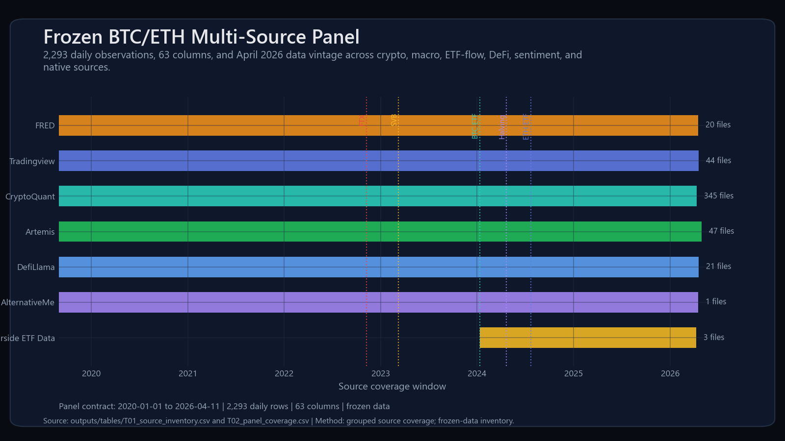
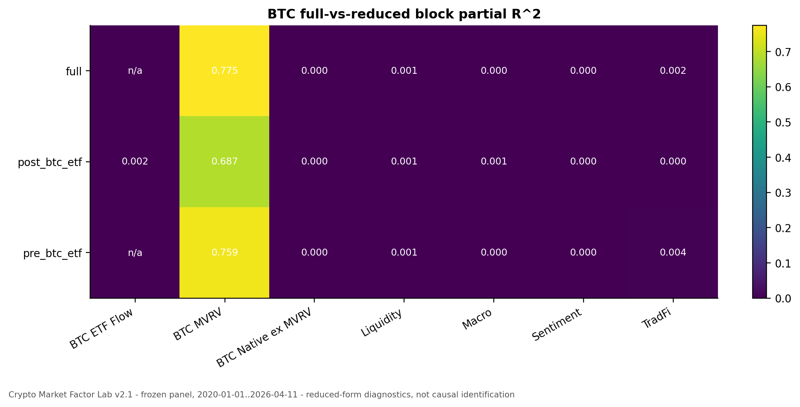
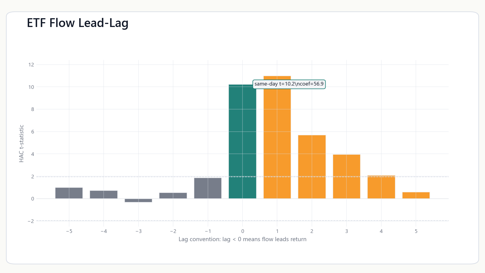
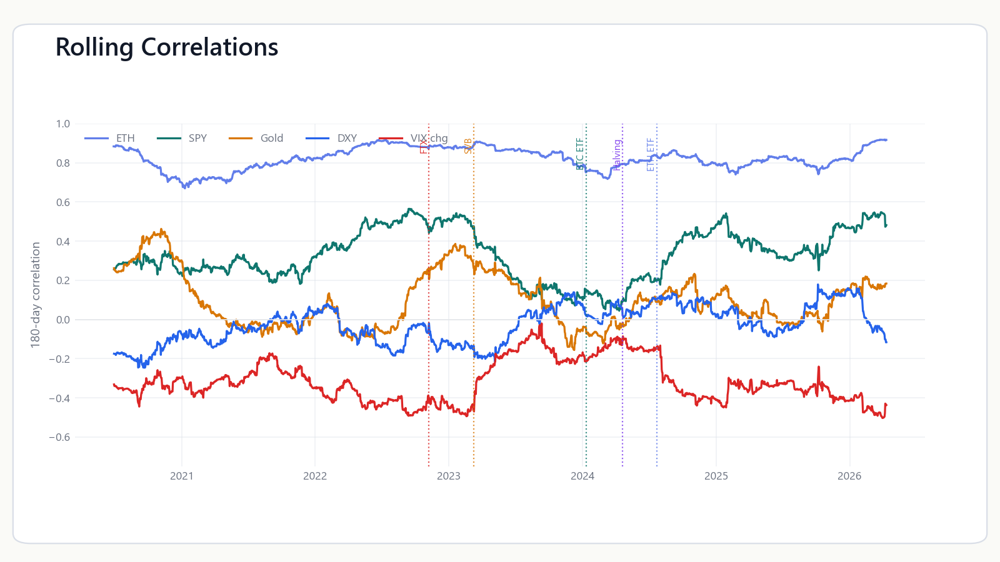
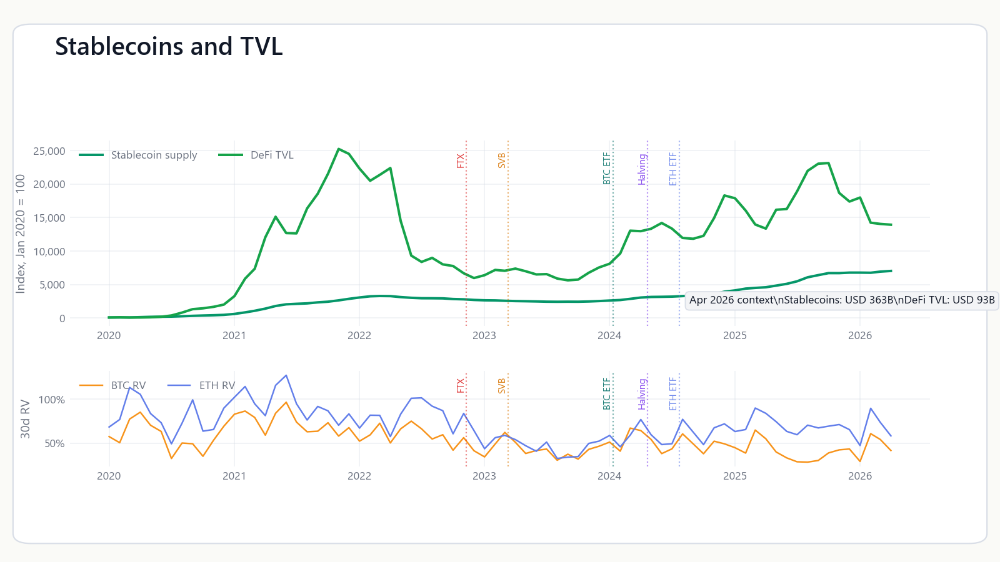
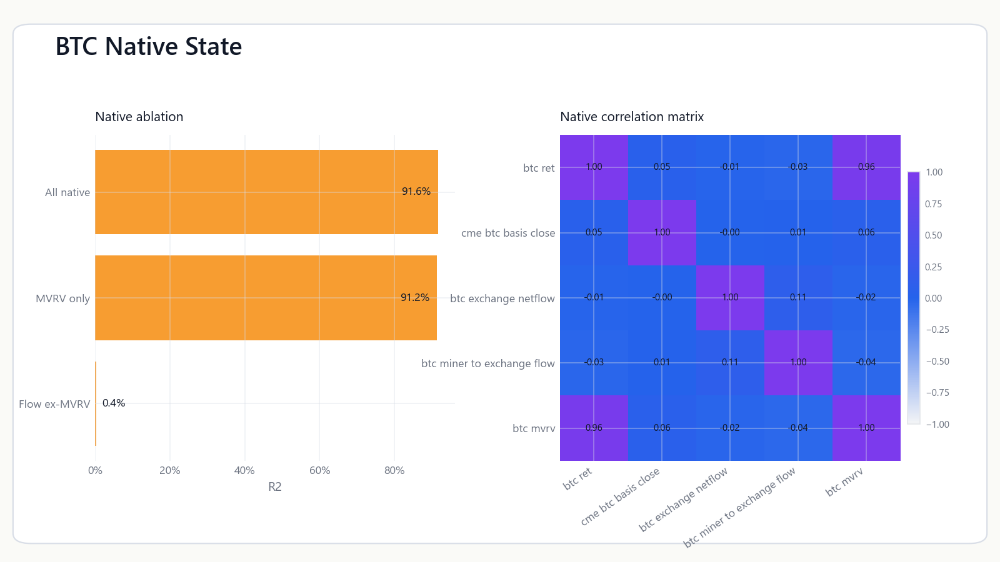
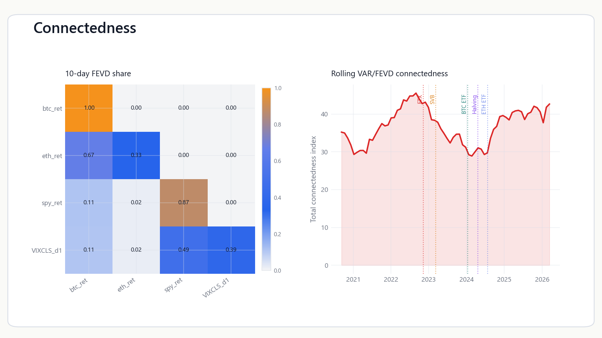
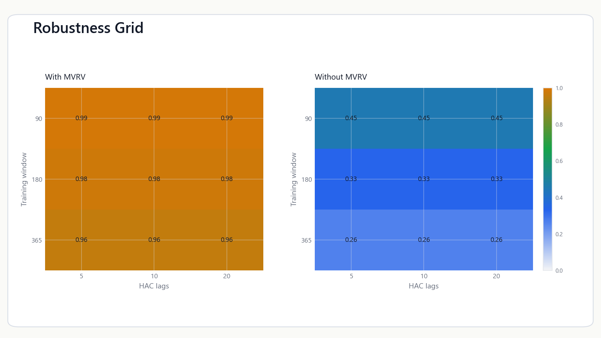

# Crypto Market Factor Lab

> A reproducible Python analytics system for BTC/ETH factor regimes, ETF-flow
> market plumbing, stablecoin liquidity, cross-asset connectedness, and
> crypto-native market structure using a frozen 2020-2026 multi-source panel.

## Overview

Crypto Market Factor Lab converts curated crypto, macro, ETF-flow, DeFi,
stablecoin, sentiment, and on-chain data into a reproducible BTC/ETH research
panel and a set of reduced-form analytics modules.

The project is designed as a clean GitHub research system: one canonical output
packet, one reproducible command path, explicit model cards, and clear
interpretation guardrails. It does not claim that ETF flows caused BTC or ETH
returns. ETF-flow results are treated as association, exposure, lead-lag, and
market-plumbing diagnostics.

All public artifacts live in [`outputs/`](outputs/).

## Data

The public artifact packet uses a frozen daily panel from 2020-01-01 through
2026-04-11 with 2,293 rows and 63 columns. Frozen data keeps the project
reproducible without paid data, live API calls, or source refresh drift.

| Source | Role |
|---|---|
| CryptoQuant | BTC/ETH native, on-chain, and market-structure indicators |
| Farside ETF Data | BTC and ETH ETF flows |
| DefiLlama | TVL, stablecoin, and DeFi liquidity context |
| FRED | Macro, rates, dollar, and volatility variables |
| TradingView | Cross-asset market data |
| Artemis | ETF, DeFi, and chain context |
| AlternativeMe | Sentiment |

The clean catalog entry point is [`docs/data/catalog/`](docs/data/catalog/).
The historical source-data tree remains under `Data/` for compatibility with
existing scripts.

## Methodology

- Feature engineering for returns, differences, ETF-flow intensity, realized
  volatility, and BTC-native variables.
- HAC OLS for reduced-form BTC/ETH factor exposure.
- Full-vs-reduced block partial R2 for factor-block attribution.
- ETF-flow and stablecoin lead-lag regressions with explicit lag convention.
- Rolling cross-asset correlations and pre/post event deltas.
- Stablecoin supply and DeFi TVL liquidity proxy diagnostics.
- BTC-native factor registry, correlations, and ablations.
- Chow tests and single-break sup-F scans for structural-break diagnostics.
- VAR/FEVD connectedness and event-study diagnostics.
- Advanced diagnostics: PCA blocks, exact block Shapley R2, exploratory CUSUM,
  FEVD-order sensitivity, rolling connectedness, and robustness grids.

Method details live in [`docs/methodology/`](docs/methodology/).

## Key Results

| Question | Diagnostic | Output |
|---|---|---|
| Which factor blocks matter? | Block attribution and ablation | [`T03_block_attribution.csv`](outputs/tables/T03_block_attribution.csv) |
| Do ETF flows line up with returns? | ETF lead-lag grid | [`T04_etf_lead_lag.csv`](outputs/tables/T04_etf_lead_lag.csv) |
| How do correlations evolve? | Rolling and pre/post correlation diagnostics | [`T05_correlation_regime.csv`](outputs/tables/T05_correlation_regime.csv) |
| What does liquidity look like? | Stablecoin and TVL proxies | [`T06_stablecoin_liquidity.csv`](outputs/tables/T06_stablecoin_liquidity.csv) |
| How do BTC-native variables behave? | Native registry and ablation | [`T07_native_factor_ablation.csv`](outputs/tables/T07_native_factor_ablation.csv) |
| Are there regime breaks? | Chow and single-break sup-F | [`T08_structural_breaks.csv`](outputs/tables/T08_structural_breaks.csv) |
| How connected are BTC, ETH, and TradFi variables? | VAR/FEVD connectedness | [`T09_connectedness.csv`](outputs/tables/T09_connectedness.csv) |
| Are results robust to modeling choices? | Sensitivity grid | [`T10_robustness.csv`](outputs/tables/T10_robustness.csv) |

Main findings:

1. BTC full-stack fit is heavily influenced by native valuation and flow-state
   variables, especially MVRV-style valuation state.
2. ETF-flow intensity has strong same-day association, but daily data cannot
   identify causal flow impact.
3. Rolling correlations show time-varying BTC/ETH integration with TradFi and
   volatility variables.
4. Stablecoin supply and TVL are useful liquidity context, not identified
   liquidity shocks.
5. Structural-break diagnostics are Chow and single-break sup-F diagnostics,
   not full multi-break identification.
6. Advanced attribution and robustness diagnostics are available in the
   methodology appendix and model cards.

## Figures

### Data Coverage



### BTC Block Attribution



### ETF Flow Lead-Lag



### Rolling Correlations



### Stablecoin Supply And TVL



### BTC-Native Dashboard



### Connectedness



### Robustness



## Reproduce

```powershell
uv sync --all-extras
uv run pytest
uv run mypy src/cqresearch
uv run python scripts/run_all.py
```

## Repository Structure

```text
README.md              public project overview
Data/                  frozen source-data tree
docs/                  methodology, architecture, data, and decisions
outputs/               canonical reports, figures, tables, model cards, manifest
scripts/               reproducible entry points and legacy-compatible pipelines
src/cqresearch/        reusable Python package
tests/                 unit tests
archive/               retained provenance, not the public workflow
```

## Outputs

- Reports: [`outputs/report/`](outputs/report/)
- Figures: [`outputs/figures/`](outputs/figures/)
- Tables: [`outputs/tables/`](outputs/tables/)
- Model cards: [`outputs/model_cards/`](outputs/model_cards/)
- Manifest: [`outputs/manifest.json`](outputs/manifest.json)

## Limitations

- Daily data cannot identify intraday mechanisms or order flow.
- ETF-flow, stablecoin, and native-factor outputs are reduced-form diagnostics,
  not causal identification.
- Stablecoin supply and TVL are proxies, not proven liquidity shocks.
- Structural-break diagnostics use Chow and single-break sup-F tests, not full
  Bai-Perron multiple-break estimation.
- Advanced attribution depends on block definitions and the selected feature
  set.
- Frozen data makes the project reproducible, but it is not a live market
  monitor.

## Data And License Notes

Code and generated artifacts are organized for reproducible research review.
External datasets and third-party references retain their upstream terms. See
the source catalog under [`docs/data/catalog/`](docs/data/catalog/) for the
frozen data inventory.
