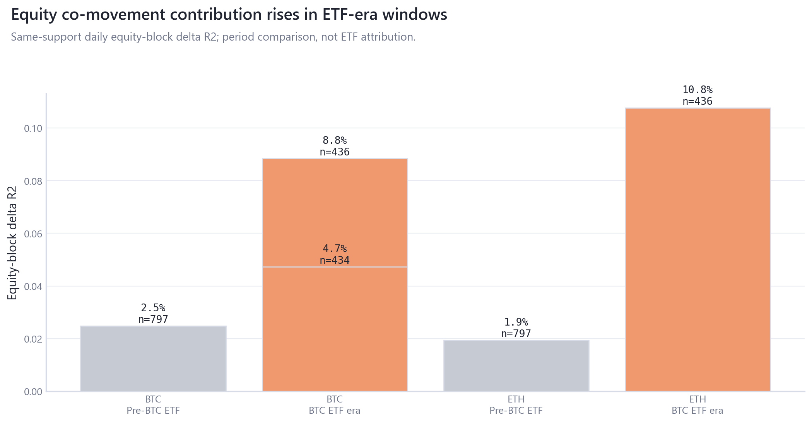
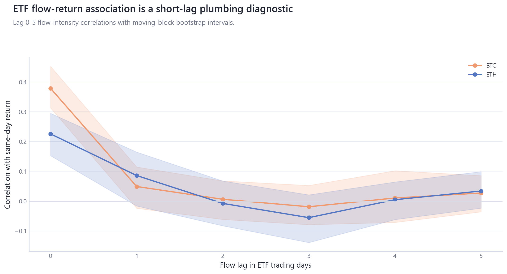

# Crypto Market Dynamics

## Project Overview

Crypto Market Dynamics is an empirical research and experimentation repository that uses the full available crypto, market, macro, derivatives, ETF, stablecoin/DeFi, on-chain, chain-fundamental, and point-in-time data universe to investigate price behavior, cross-asset relationships, liquidity, leverage, market-microstructure proxies, risk transmission, and the evolution of the broader crypto market and relevant assets and sectors.

The repository is descriptive and associational. Forecasting and trading-strategy claims are outside scope.

## What This Repository Analyzes

- Cross-asset crypto and TradFi dependence, common-factor structure, and lower-tail co-exceedance.
- Macro/TradFi integration through synchronized exposure models and rolling co-movement diagnostics.
- Derivatives leverage, funding, open-interest scaling, and liquidation stress states.
- ETF flow timing, lag-response, absorption, and flow-shock/placebo diagnostics.
- Stablecoin/DeFi balance-sheet state proxies and valuation-contamination checks.
- On-chain valuation/holder behavior with same-day MVRV treated as measurement mechanics.
- Chain fundamentals, monthly point-in-time sector/state variables, relative selected-asset risk, and event stress synthesis.

## Data Universe and Asset Coverage

The data-foundation module inventories provider files, processed panels, feature semantics, asset identity, timing, units, and release risk. Current data-usage counts are `diagnostic_only`=65, `excluded_ambiguous_definition_or_unit`=105, `excluded_insufficient_coverage`=2, `primary_analysis`=25, `robustness_or_sensitivity`=2.

The selected crypto universe audits BTC, ETH, BNB, SOL, XRP, DOGE, TRX, TON, ADA, HYPE, and any locally covered current-cohort assets. TradFi/macro coverage includes SPY, QQQ, IWM, DXY, gold, VIX, nominal and real yield changes where local panels support matched samples.

## Research Modules

| Module | Title | Scope |
|---|---|---|
| [00_data_measurement_foundation](research/00_data_measurement_foundation/README.md) | Data and Measurement Foundation | What data, assets, units, timing, coverage, identity, and release-risk constraints govern later empirical claims? |
| [01_cross_asset_dependence_regimes](research/01_cross_asset_dependence_regimes/README.md) | Cross-Asset Dependence and Regimes | How do crypto and TradFi return dependence, common-factor share, lower-tail co-exceedance, and regimes vary across matched samples? |
| [02_macro_tradfi_integration](research/02_macro_tradfi_integration/README.md) | Macro and TradFi Integration | How do crypto exposures to equities, volatility, rates, the dollar, gold, and credit vary across calendars and periods? |
| [03_derivatives_leverage_liquidations](research/03_derivatives_leverage_liquidations/README.md) | Derivatives, Leverage, and Liquidations | Where do leverage, funding, open-interest scaling, and liquidation stress appear in volatility and tail outcomes? |
| [04_etf_institutional_flows](research/04_etf_institutional_flows/README.md) | ETF and Institutional Flows | How do ETF flow intensity, timing, lag response, and shock/placebo diagnostics line up with crypto outcomes? |
| [05_stablecoin_defi_liquidity](research/05_stablecoin_defi_liquidity/README.md) | Stablecoin and DeFi Liquidity State | What do stablecoin supply and DeFi TVL proxies say about liquidity-state associations after unit and valuation audits? |
| [06_onchain_valuation_holder_behavior](research/06_onchain_valuation_holder_behavior/README.md) | On-Chain Valuation and Holder Behavior | Which on-chain valuation and holder-state measures are diagnostics versus admissible lagged state variables? |
| [07_chain_fundamentals_sector_dynamics](research/07_chain_fundamentals_sector_dynamics/README.md) | Chain Fundamentals and Sector Dynamics | Which chain-level activity, sector, and point-in-time state measures have enough coverage and definition clarity for descriptive panel analysis? |
| [08_relative_asset_risk_factor_structure](research/08_relative_asset_risk_factor_structure/README.md) | Relative Asset Risk and Factor Structure | How do selected crypto assets compare on matched-window risk, downside beta, expected shortfall, and common-versus-idiosyncratic factor structure? |
| [09_event_stress_cross_module_synthesis](research/09_event_stress_cross_module_synthesis/README.md) | Event Stress and Cross-Module Synthesis | Which event-window, stress-state, and cross-module findings remain strongest after comparing sample, method, uncertainty, measurement risk, and limitations? |

## Headline Findings

| Module | Finding | Grade | Source | Limitation |
|---|---|---|---|---|
| 00_data_measurement_foundation | The local inventory covers 584 raw series across 8 provider groups and 31 registered features. | A for local inventory; B for release-risk classification. | [research/00_data_measurement_foundation/tables/provider_inventory.csv](research/00_data_measurement_foundation/tables/provider_inventory.csv) | Provider files remain local and untracked. |
| 01_cross_asset_dependence_regimes | Selected-major crypto returns share a strong common factor on the matched current-cohort daily panel. | B | [research/01_cross_asset_dependence_regimes/tables/pca_common_factor_loadings.csv](research/01_cross_asset_dependence_regimes/tables/pca_common_factor_loadings.csv) | Current-cohort daily data is survivorship-biased and does not establish historical altseason behavior. |
| 02_macro_tradfi_integration | Later-sample equity co-movement is higher in the synchronized BTC/ETH exposure tables. | B | [research/02_macro_tradfi_integration/tables/block_delta_r2.csv](research/02_macro_tradfi_integration/tables/block_delta_r2.csv) | Period splits are descriptive and do not identify ETF effects. |
| 03_derivatives_leverage_liquidations | Lagged leverage/funding/OI states are associated with volatility and tail-stress diagnostics. | B | [research/03_derivatives_leverage_liquidations/tables/leverage_tail_risk_summary.csv](research/03_derivatives_leverage_liquidations/tables/leverage_tail_risk_summary.csv) | Liquidation observations are timing-sensitive and do not prove directional liquidation attribution. |
| 04_etf_institutional_flows | ETF flow-return associations are reported as lag-response market-plumbing diagnostics with separate BTC and ETH source starts. | B | [research/04_etf_institutional_flows/tables/etf_lag_response.csv](research/04_etf_institutional_flows/tables/etf_lag_response.csv) | Reported ETF flows have timing and simultaneity concerns; no causal price-impact claim. |
| 05_stablecoin_defi_liquidity | Stablecoin supply and DeFi TVL are endogenous liquidity-state proxies; raw USD TVL embeds valuation content. | B | [research/05_stablecoin_defi_liquidity/tables/liquidity_associations.csv](research/05_stablecoin_defi_liquidity/tables/liquidity_associations.csv) | No exogenous liquidity-shock language is supported. |
| 06_onchain_valuation_holder_behavior | Same-day MVRV is measurement mechanics; lagged holder-state tables are diagnostics, not primary same-day factors. | B | [research/06_onchain_valuation_holder_behavior/tables/mvrv_mechanical_link_audit.csv](research/06_onchain_valuation_holder_behavior/tables/mvrv_mechanical_link_audit.csv) | Realized-cap source conventions affect residual interpretation. |
| 07_chain_fundamentals_sector_dynamics | Chain fundamentals and PIT state variables currently support coverage and state-model diagnostics before headline relationship claims. | B | [research/07_chain_fundamentals_sector_dynamics/tables/chain_fundamental_panel_summary.csv](research/07_chain_fundamentals_sector_dynamics/tables/chain_fundamental_panel_summary.csv) | PIT state is monthly and cannot support daily constituent-performance claims. |
| 08_relative_asset_risk_factor_structure | Selected-major risk separates into a common crypto factor and asset-specific residual risk on the matched current-cohort window. | B | [research/08_relative_asset_risk_factor_structure/tables/relative_factor_decomposition.csv](research/08_relative_asset_risk_factor_structure/tables/relative_factor_decomposition.csv) | Short histories and current-cohort survivorship bias limit historical interpretation. |
| 09_event_stress_cross_module_synthesis | Registered event windows and cross-module evidence are reported as stress/sensitivity diagnostics with explicit limitations. | B | [research/09_event_stress_cross_module_synthesis/tables/event_inference.csv](research/09_event_stress_cross_module_synthesis/tables/event_inference.csv) | Event windows and synthesis do not create causal identification. |

## Selected Analytical Results

### Common crypto dependence is broad on the matched selected-major panel.


Sample and method: see source table; clustered_correlation_heatmap from `research/01_cross_asset_dependence_regimes/tables/pearson_correlation_matrix.csv; research/01_cross_asset_dependence_regimes/tables/pca_variance_share.csv`.

Interpretation: Common crypto dependence is broad on the matched selected-major panel. Boundary: Current-cohort selected-major daily data is survivorship-biased. Selection score: 5.00 ([selection table](research/root_figure_selection.csv)).

### Later-sample equity co-movement is higher for BTC and ETH.



Sample and method: see source table; coefficient_and_block_contribution from `research/02_macro_tradfi_integration/tables/block_delta_r2.csv; research/02_macro_tradfi_integration/tables/rolling_tradfi_exposures.csv`.

Interpretation: Later-sample equity co-movement is higher for BTC and ETH. Boundary: Period comparison, not ETF-effect identification. Selection score: 4.60 ([selection table](research/root_figure_selection.csv)).

### Leverage states are stress diagnostics.


Sample and method: see source table; state_conditioned_tail_risk from `research/03_derivatives_leverage_liquidations/tables/leverage_tail_risk_summary.csv; research/03_derivatives_leverage_liquidations/tables/tail_risk_models.csv`.

Interpretation: Leverage states are stress diagnostics. Boundary: No liquidation initiation-cause claim. Selection score: 4.40 ([selection table](research/root_figure_selection.csv)).

### ETF flow intensity is reported as a lag-response market-plumbing diagnostic.



Sample and method: see source table; lag_response_with_bootstrap_interval from `research/04_etf_institutional_flows/tables/etf_lag_response.csv; research/04_etf_institutional_flows/tables/etf_pre_inception_plot_audit.csv`.

Interpretation: ETF flow intensity is reported as a lag-response market-plumbing diagnostic. Boundary: Timing and simultaneity limit interpretation. Selection score: 4.80 ([selection table](research/root_figure_selection.csv)).

### Selected-major matched-window risk separates common and idiosyncratic components.


Sample and method: see source table; common_idiosyncratic_risk_decomposition from `research/08_relative_asset_risk_factor_structure/tables/relative_factor_decomposition.csv; research/08_relative_asset_risk_factor_structure/tables/downside_expected_shortfall.csv`.

Interpretation: Selected-major matched-window risk separates common and idiosyncratic components. Boundary: Current-cohort and short-history caveats limit historical interpretation. Selection score: 4.60 ([selection table](research/root_figure_selection.csv)).

## Methods Used

| Method family | Used for | Key boundary |
|---|---|---|
| Correlation, partial correlation, clustered heatmaps | dependence/regime diagnostics | association, not causation |
| PCA/common-factor decomposition | selected-major and cross-asset structure | descriptive factor structure only |
| HAC OLS, block/partial R-squared, FDR, VIF, ridge | macro/TradFi exposure | contemporaneous co-movement |
| Quantile/tail, logit-style state tables, event/placebo windows | derivatives and event stress | stress diagnostics |
| Lag-response and block bootstrap | ETF flow plumbing | timing/simultaneity caveats |
| Coverage, unit, timing, and measurement-risk audits | data governance | release risk and semantics before claims |

## Important Limitations

- Current-cohort daily selected-major analysis is survivorship-biased and cannot establish historical altseason behavior.
- ETF flows are market-plumbing associations with timing and simultaneity concerns.
- Stablecoin supply, DeFi TVL, and related balance-sheet measures are endogenous state proxies; raw USD TVL is valuation-sensitive.
- Same-day MVRV is a mechanically price-linked valuation-state diagnostic and is excluded from primary BTC/ETH models.
- Monthly point-in-time data supports composition, concentration, turnover, and state variables only, not daily constituent returns.

## Reproduce

```bash
uv sync --all-extras
uv run ruff check src/cqresearch scripts tests
uv run ruff format --check src/cqresearch scripts tests
uv run mypy src/cqresearch
uv run pytest -q
uv run python scripts/run_research.py --module all
uv run python scripts/build_research_figures.py --module all
uv run python scripts/check_research_surface.py --module all
```

## Repository Structure

- [`research/`](research/README.md): canonical public research surface.
- [`src/cqresearch/`](src/cqresearch): pipeline, research, and visualization code.
- [`scripts/`](scripts): thin command-line entry points.
- [`config/`](config): feature, figure, module, and event registries.
- `data_local/`: local raw and processed provider data; intentionally untracked.

## Data Policy and Citation

Raw/provider data stays local under `data_local/` and outside Git. Public tables and figures are derived semantic outputs designed for review and reproducibility without redistributing restricted exports.

This repository is independent research infrastructure and is not affiliated with any provider. Cite the repository, commit hash, module, table, figure, sample definition, and limitations when referencing a result.
