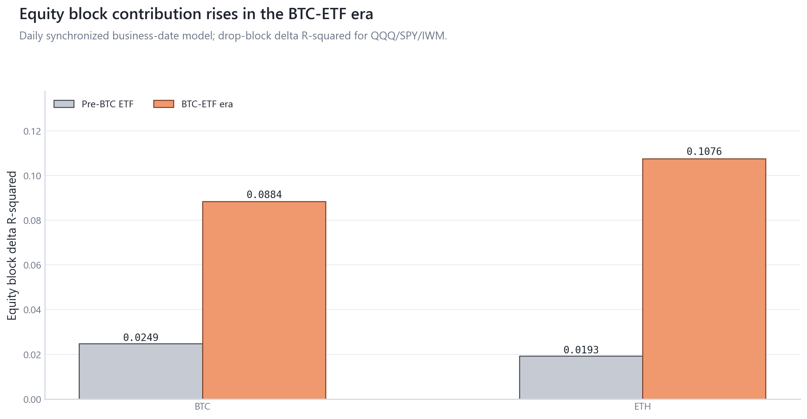
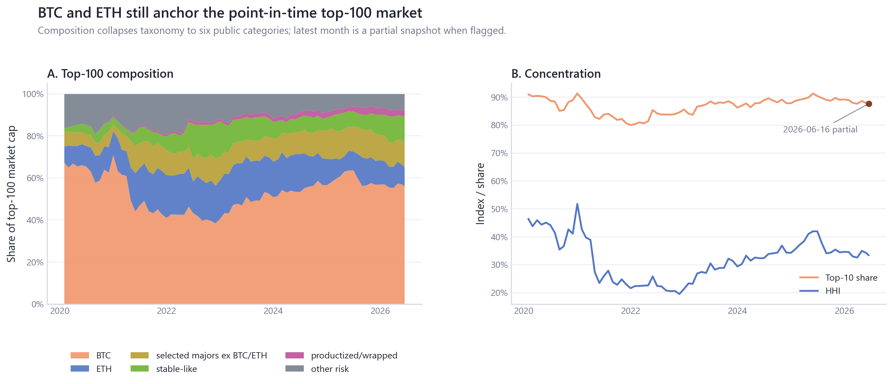

# Crypto Market Dynamics

Crypto Market Dynamics is a descriptive research-code repository asking how crypto market behavior from 2020-2026 evolved into a hybrid market shaped by measurement mechanics, macro co-movement, ETF access, leverage, liquidity state, market structure, and selected-major risk.

It is not a price-forecasting system, trading strategy, or causal ETF-flow study.

## The Question

Which crypto-market measurements genuinely add state information, and which mostly repackage price, while BTC and ETH became more entangled with equity risk, ETF access, leverage, stablecoin/DeFi balance sheets, and changing market structure?

The main synthesis is deliberately restrained: same-day MVRV is mostly a mechanical price-linked diagnostic; lagged state variables explain little average daily return variation; later-sample TradFi co-movement is higher; ETF flows are best read as market plumbing with timing limits; leverage and liquidity measures are more credible as stress-state diagnostics; monthly point-in-time snapshots support structure, not historical constituent performance.

## Key Findings

| Finding                                             | Evidence                                                                                                                                                                                                                                                                          | Interpretation                                                                   | Boundary                                                                                  |
|:----------------------------------------------------|:----------------------------------------------------------------------------------------------------------------------------------------------------------------------------------------------------------------------------------------------------------------------------------|:---------------------------------------------------------------------------------|:------------------------------------------------------------------------------------------|
| MVRV overlap is a measurement warning               | corr(BTC return, d-log MVRV)=0.9966; R2=0.9932; median abs residual / median abs BTC return=1.14e-07 ([table](outputs/tables/mvrv_mechanical_link_audit.csv), grade B)                                                                                                            | Same-day MVRV is mechanically price-linked; primary BTC/ETH models stay ex-MVRV. | Use lagged valuation state as context, not an independent same-day factor.                |
| Later-sample equity co-movement is higher           | BTC equity block pre-BTC-ETF delta R2=0.0249 (n=797) vs BTC-ETF-era delta R2=0.0884 (n=436); ETH equity block pre-BTC-ETF delta R2=0.0193 (n=797) vs BTC-ETF-era delta R2=0.1076 (n=436); period comparison, not ETF effect ([table](outputs/tables/block_delta_r2.csv), grade B) | A period comparison shows stronger contemporaneous equity-block contribution.    | Not an ETF-effect estimate; rolling windows overlap and exposures are collinear.          |
| Lagged-state mean-return fit is weak                | BTC daily lagged-state full R2=0.0064, n=2263; ETH daily lagged-state full R2=0.0055, n=2263 ([table](outputs/tables/frequency_robustness.csv), grade B)                                                                                                                          | Crypto-native state variables add little average daily return explanation.       | Treat as a negative result, not a signal-ranking exercise.                                |
| ETF flow associations are mostly lag 0              | BTC lag0 return corr=0.379 (n=820) vs lag1=0.049 (n=819); ETH lag0 return corr=0.226 (n=627) vs lag1=0.086 (n=626) ([table](outputs/tables/etf_flow_associations.csv), grade B)                                                                                                   | Reported-flow-day associations dominate lag-1 associations.                      | Timing and simultaneity prevent causal flow-return claims.                                |
| Leverage states behave more like stress diagnostics | Q1 low tail-day rate=7.06% (n=453); Q3 tail-day rate=4.20% (n=452); Q5 high tail-day rate=7.73% (n=453); read as U-shaped state pattern ([table](outputs/tables/leverage_tail_risk_summary.csv), grade B)                                                                         | Tail stress is U-shaped across lagged leverage states.                           | No liquidation initiation-cause claim; USD/notional denominators can embed price content. |
| PIT structure remains concentrated                  | 2026-06-16 partial snapshot (month=2026-06) top10 share=87.64%, HHI=0.334 ([table](outputs/tables/pit_market_structure_summary.csv), grade A)                                                                                                                                     | Monthly snapshots support composition, concentration, and turnover evidence.     | No daily PIT constituent performance or historical altseason backtest.                    |


## Data Universe

| Domain | Core measures | Frequency/coverage | Public-data posture |
|---|---|---|---|
| BTC/ETH and TradFi | returns, equity, dollar, rates, volatility, gold | daily business-date and Friday weekly panels | derived outputs only; source coverage in [data_source_coverage.csv](outputs/tables/data_source_coverage.csv) |
| ETF access | BTC/ETH ETF flows, AUM, flow-to-lagged-market-cap | ETF trading dates and ETF-era weekly rows | derived market-plumbing summaries |
| Leverage/liquidity | funding, OI, leverage, liquidations, stablecoin supply, TVL | daily and Sunday-ended weekly panels | local provider inputs; public semantic summaries |
| Market structure | PIT top-100/top-200 composition, concentration, turnover | monthly snapshots through the latest partial month | structure-only evidence |
| Selected majors | BTC, ETH, BNB, SOL, XRP, DOGE, TRX, TON, ADA, HYPE | current-source daily coverage with matched-window tables | coverage-aware risk summaries |

## Method Map

| Question | Design | Uncertainty/robustness | Interpretation |
|---|---|---|---|
| Measurement overlap | same-interval MVRV identity audit | residual scale and lagged-state separation | measurement warning |
| Exposure evolution | synchronized daily and Friday weekly HAC OLS | same support, VIF, FDR, rolling summaries | contemporaneous co-movement |
| ETF plumbing | lag-0/lag-1 flow-return grid and absorption ratios | ETF trading-date timing audit | reported-flow association |
| Leverage/liquidity stress | lagged state bins, tail-rate models, denominator scaling | counts, class balance, contamination audit | stress-state diagnostics |
| PIT structure | monthly composition, HHI, top-share, turnover | partial-month flags and ID audit | market structure only |
| Selected-major risk | matched-window volatility, drawdown, beta, coverage | separate coverage tables | coverage-aware comparison |

## Measurement Integrity

MVRV is a valuation-state diagnostic, not an independent same-day factor. [MVRV mechanics](outputs/figures/gallery/measurement_mvrv_mechanics.png) stays in the gallery because its main role is methodological: same-day `d_log_mvrv` overlaps almost one-for-one with BTC returns. Primary BTC/ETH models exclude same-day MVRV; lagged MVRV state is retained only as conditioning context. Source: [mvrv_mechanical_link_audit.csv](outputs/tables/mvrv_mechanical_link_audit.csv).

## Macro Integration And Institutional Access

Later-sample equity-block contribution is higher for both BTC and ETH on synchronized business-date models.



This is a period comparison of contemporaneous co-movement, not an ETF attribution design. Source: [block_delta_r2.csv](outputs/tables/block_delta_r2.csv), [rolling_tradfi_exposures.csv](outputs/tables/rolling_tradfi_exposures.csv).

ETF flow associations are much larger at lag 0 than lag 1, making reporting-day timing central.


The flow measures are scaled by lagged market cap and interpreted as access/plumbing variables. Source: [etf_flow_associations.csv](outputs/tables/etf_flow_associations.csv), [etf_absorption_metrics.csv](outputs/tables/etf_absorption_metrics.csv).

## Leverage And Liquidity State

Lagged leverage states show a U-shaped tail-stress pattern and higher realized volatility in the low/high state regions.


Stablecoin supply and DeFi TVL are treated as endogenous balance-sheet proxies; raw USD TVL is explicitly valuation-sensitive. Source: [leverage_tail_risk_summary.csv](outputs/tables/leverage_tail_risk_summary.csv), [valuation_contamination_audit.csv](outputs/tables/valuation_contamination_audit.csv), [stablecoin_defi_liquidity_summary.csv](outputs/tables/stablecoin_defi_liquidity_summary.csv).

## Market Structure And Selected-Major Risk

Monthly PIT snapshots show a still-concentrated top-100 market and preserve the latest partial-snapshot flag.



This supports composition, concentration, and turnover evidence only. Source: [pit_market_structure_summary.csv](outputs/tables/pit_market_structure_summary.csv), [pit_turnover.csv](outputs/tables/pit_turnover.csv).

Current-top50 daily cohort outputs, where present, are deferred from public claims and treated as exploratory and survivorship-biased.

Selected majors differ sharply in volatility and drawdown, but coverage is part of the result rather than a footnote.


HYPE is marked as short-history, and comparable-window metrics are separated from maximum-coverage views. Source: [selected_major_risk_metrics.csv](outputs/tables/selected_major_risk_metrics.csv), [selected_major_comparable_window_metrics.csv](outputs/tables/selected_major_comparable_window_metrics.csv).

## What We Can And Cannot Claim

| Supported | Not supported |
|---|---|
| later-sample co-movement is higher | ETFs as the identified reason for the change |
| flow-day association and absorption | ETF flows as a return driver |
| leverage/liquidity state relates to stress | a tradable return signal |
| PIT concentration and composition | daily historical altseason performance |
| MVRV as valuation-state context | same-day MVRV as an independent factor |

Event windows remain appendix context in [the gallery](outputs/figures/gallery/appendix_event_response_matrix.png), not treatment evidence.

## Reproduce

### Public smoke validation

These checks work from a public clone using committed code and semantic outputs:

```powershell
uv sync --all-extras
uv run ruff check src/cqresearch scripts tests
uv run ruff format --check src/cqresearch scripts tests
uv run mypy src/cqresearch
uv run pytest -q
uv run python scripts/check_public_surface.py
```

### Full local rebuild

Full empirical regeneration requires legally obtained local provider inputs:

```text
data_local/
  raw/
  interim/
  processed/
  curated/
  metadata/
```

```powershell
uv run python scripts/run_all.py
uv run python scripts/build_public_figures.py
uv run pytest -q
uv run python scripts/check_public_surface.py
```

## Repository Map

- `data_local/` ignored local provider exports, intermediates, and feature stores.
- `config/` asset, event, feature, and figure configuration.
- `src/cqresearch/` maintained data, feature, modeling, analysis, reporting, visualization, and pipeline code.
- `scripts/` thin CLI entry points.
- `outputs/` generated public tables, figures, reports, and model cards.
- `docs/` methodology, data, architecture, and decisions.

## Data Policy, License, And Citation

Raw/provider data is local-only under `data_local/raw` and ignored by Git. The repository ships code, docs, figures, model cards, and derived semantic outputs; it does not redistribute restricted provider exports. This project is not affiliated with CryptoQuant, Artemis, TradingView, DefiLlama, Farside, AlternativeMe, FRED, or other data providers. See [DATA_LICENSE.md](DATA_LICENSE.md), [provider_data_disposition.csv](outputs/tables/provider_data_disposition.csv), and [docs/data](docs/data).

Public claims map to [evidence_ledger.csv](outputs/tables/evidence_ledger.csv) and [claim_inventory.csv](outputs/tables/claim_inventory.csv). Code is MIT licensed; data-source terms remain separate.
