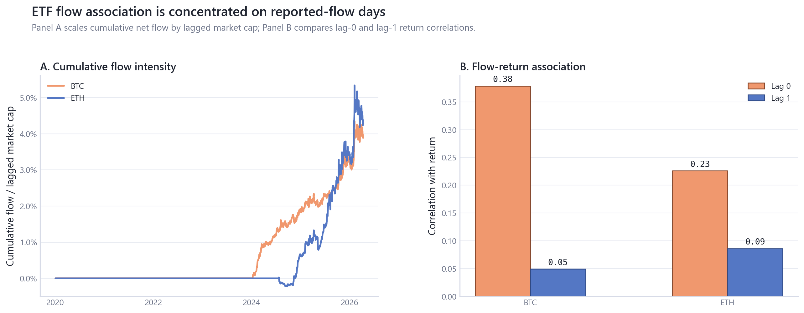
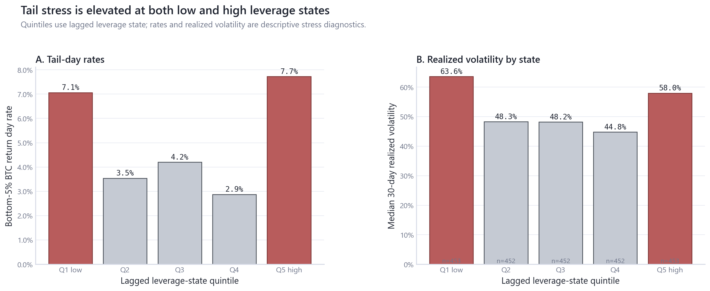
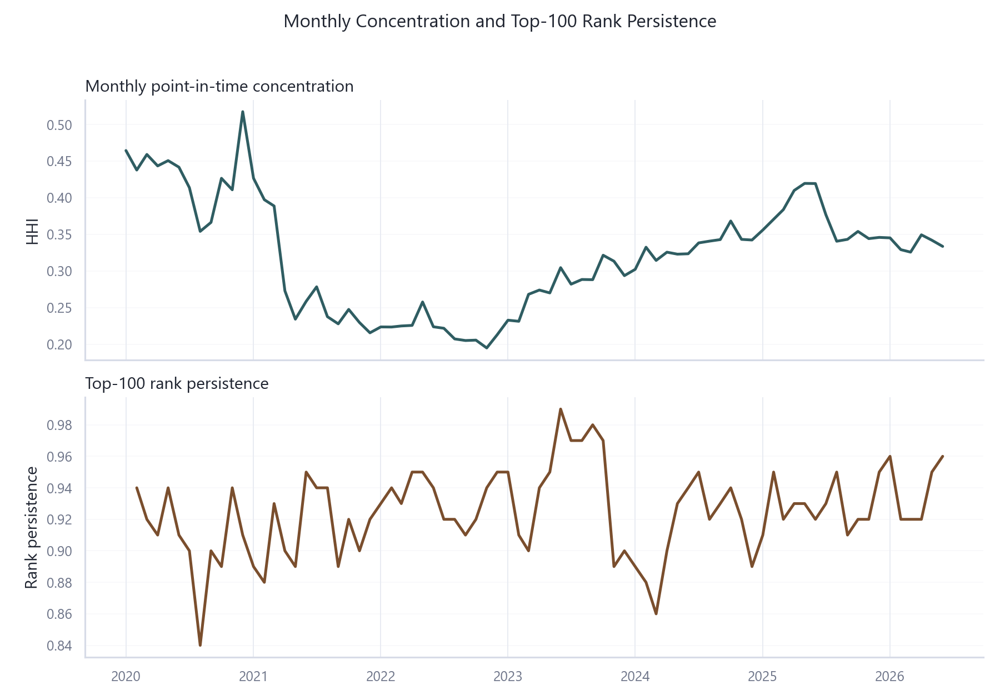
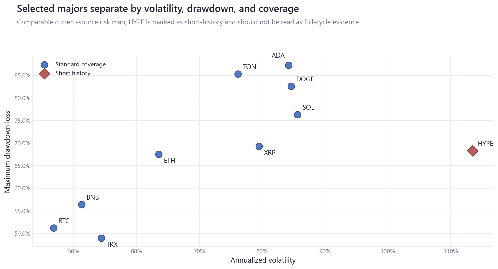

# Crypto Market Dynamics

Crypto Market Dynamics is a descriptive empirical research repository asking how crypto market behavior from 2020-2026 evolved across measurement mechanics, macro co-movement, ETF access, leverage, liquidity state, point-in-time market structure, and selected-major risk.

It is not a price-forecasting system, trading strategy, or causal ETF-flow study.

## Research Question

Which crypto-market measurements add state information, and which mostly repackage price, as BTC and ETH became more entangled with equity risk, ETF access, derivatives leverage, stablecoin/DeFi balance sheets, and a still-concentrated market structure?

## Evidence Map

| Finding | Evidence | Interpretation | Boundary |
|---|---|---|---|
| Same-day MVRV is a measurement warning | corr(BTC return, d-log MVRV)=0.9966; same-day diagnostic R2=0.9932; residual scale ratio=1.14e-07. See [MVRV audit](research/06_onchain_valuation_holder_state/tables/mvrv_mechanical_link_audit.csv). | Primary BTC/ETH models stay ex-MVRV; MVRV remains a valuation-state diagnostic. | Same-day MVRV is not an independent factor. |
| Later-sample equity co-movement is higher | BTC equity-block delta R2 moved from 0.0249 pre-BTC-ETF to 0.0884 in the BTC-ETF era; ETH moved from 0.0193 to 0.1076. See [macro table](research/02_macro_cross_asset_exposure/tables/block_delta_r2.csv). | Contemporaneous equity exposure is larger in the later sample. | Period comparison, not ETF-effect identification. |
| Lagged-state average-return fit is weak | BTC daily lagged-state full R2=0.0064 and ETH daily lagged-state full R2=0.0055. See [frequency robustness](research/02_macro_cross_asset_exposure/tables/frequency_robustness.csv). | Crypto-native state variables add little average daily return explanation. | Reported as a weak result, not rescued by specification search. |
| ETF flow associations are mostly lag 0 | BTC lag0 return corr=0.379 versus lag1=0.049; ETH lag0=0.226 versus lag1=0.086. See [ETF associations](research/04_etf_institutional_plumbing/tables/etf_flow_associations.csv). | Reported-flow-day plumbing dominates lag-1 association. | Timing and simultaneity limit interpretation. |
| Leverage states are stress diagnostics | Tail-day rates are 7.06% in Q1 low leverage, 4.20% in Q3, and 7.73% in Q5 high leverage. See [leverage table](research/03_derivatives_leverage_liquidations/tables/leverage_tail_risk_summary.csv). | Tail stress is U-shaped across lagged leverage states. | No liquidation initiation-cause claim. |
| PIT structure remains concentrated | Latest PIT snapshot on 2026-06-16 has top10 share=87.64%, HHI=0.334, and rank persistence=96.00%. See [market-structure table](research/09_market_concentration_state/tables/pit_market_structure_summary.csv). | Monthly snapshots support concentration, turnover, and rank-persistence state analysis. | No daily constituent-performance claim. |

## Figure Set










## Module Map

| Module | Role |
|---|---|
| [00_data_foundation](research/00_data_foundation/README.md) | Provider inventory, feature usage matrix, coverage, missingness, units, timing, identity, and release-risk constraints. |
| [01_returns_risk_regimes](research/01_returns_risk_regimes/README.md) | BTC/ETH return distributions, drawdown, tail, and fixed-date regime risk summaries. |
| [02_macro_cross_asset_exposure](research/02_macro_cross_asset_exposure/README.md) | HAC exposure models, block delta R2, conventional partial R2, FDR, VIF, ridge, and rolling exposure diagnostics. |
| [03_derivatives_leverage_liquidations](research/03_derivatives_leverage_liquidations/README.md) | Funding, OI scaling, leverage states, liquidation ratios, tail models, and event-window stress signatures. |
| [04_etf_institutional_plumbing](research/04_etf_institutional_plumbing/README.md) | ETF flow intensity, absorption metrics, lag grids, flow-shock days, and timing audit. |
| [05_stablecoin_defi_liquidity](research/05_stablecoin_defi_liquidity/README.md) | Stablecoin and DeFi weekly state measures with explicit USD TVL valuation-contamination audit. |
| [06_onchain_valuation_holder_state](research/06_onchain_valuation_holder_state/README.md) | MVRV identity mechanics, holder-state regimes, and lagged valuation-state diagnostics. |
| [07_chain_fundamentals](research/07_chain_fundamentals/README.md) | Chain-fundamental coverage and panel-readiness before relationship claims. |
| [08_relative_major_asset_risk](research/08_relative_major_asset_risk/README.md) | Selected-major coverage, matched-window risk, downside, drawdown, and beta summaries. |
| [09_market_concentration_state](research/09_market_concentration_state/README.md) | Monthly PIT HHI, top-share fields, turnover, rank persistence, partial-month and identity audit. |
| [10_event_sensitivity](research/10_event_sensitivity/README.md) | Registered event windows and empirical placebo comparisons. |
| [11_cross_module_synthesis](research/11_cross_module_synthesis/README.md) | Claims ledger, evidence map, robustness summaries, and public-language guardrails. |

## Data Universe

Raw/provider inputs stay local under `data_local/raw/` and are not redistributed. The public repository ships code, methodology, derived tables, figures, and module manifests. Current local inventory covers 584 raw files across 8 provider groups, with provider disposition in [provider_inventory.csv](research/00_data_foundation/tables/provider_inventory.csv) and every registered or processed-panel feature assigned one usage status in [feature_usage_matrix.csv](research/00_data_foundation/tables/feature_usage_matrix.csv).

## Reproduce

Public validation from a clone:

```powershell
uv sync --all-extras
uv run ruff check src/cqresearch scripts tests
uv run ruff format --check src/cqresearch scripts tests
uv run mypy src/cqresearch
uv run pytest -q
uv run python scripts/check_research_surface.py --module all
```

Full local rebuild when legally obtained provider data is present:

```powershell
uv run python scripts/run_research.py --module all
uv run python scripts/build_research_figures.py --module all
uv run pytest -q
uv run python scripts/check_research_surface.py --module all
```

## Repository Map

- `research/` canonical public module surface.
- `src/cqresearch/` maintained data, feature, modeling, research, reporting, visualization, and pipeline code.
- `scripts/` thin CLI entry points.
- `config/` asset, event, feature, module, and figure configuration.
- `docs/` methodology, data, architecture, and decisions.
- `data_local/` ignored local provider exports, intermediates, and feature stores.

## Data Policy, License, And Citation

This project is not affiliated with CryptoQuant, Artemis, TradingView, DefiLlama, Farside, AlternativeMe, FRED, or other data providers. Raw/provider terms remain separate from the MIT-licensed code. See [DATA_LICENSE.md](DATA_LICENSE.md), [provider_inventory.csv](research/00_data_foundation/tables/provider_inventory.csv), and [docs/data](docs/data).

Public claims are traceable through module-level `claims.csv` files and the consolidated [evidence_ledger.csv](research/11_cross_module_synthesis/tables/evidence_ledger.csv).
