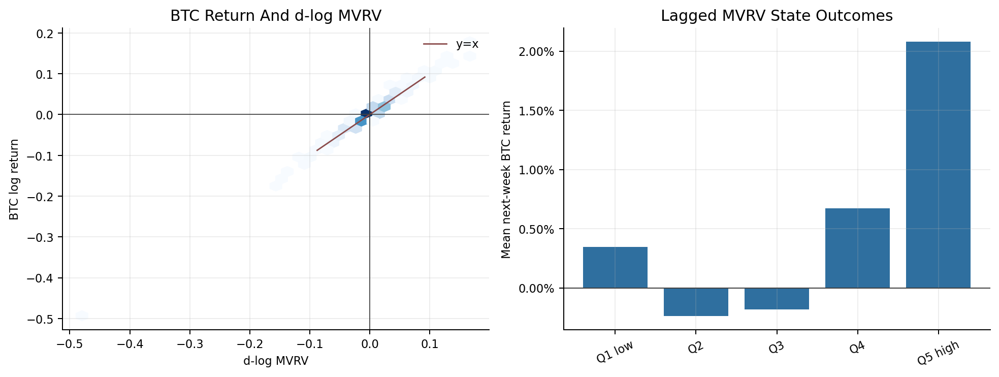
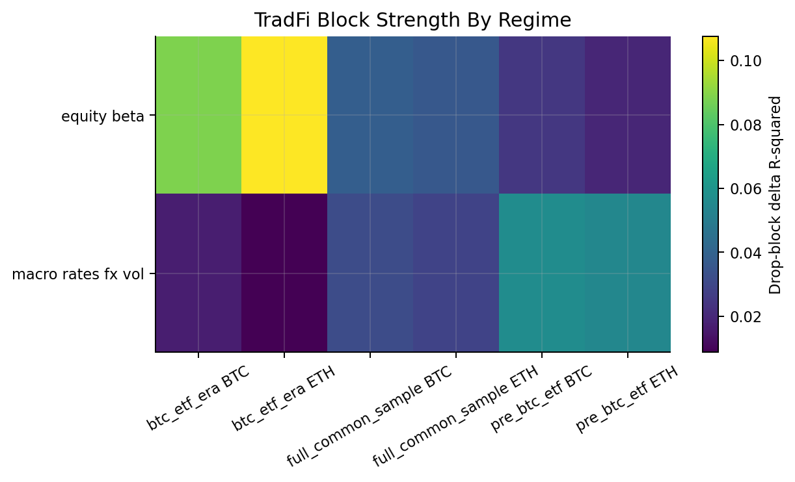
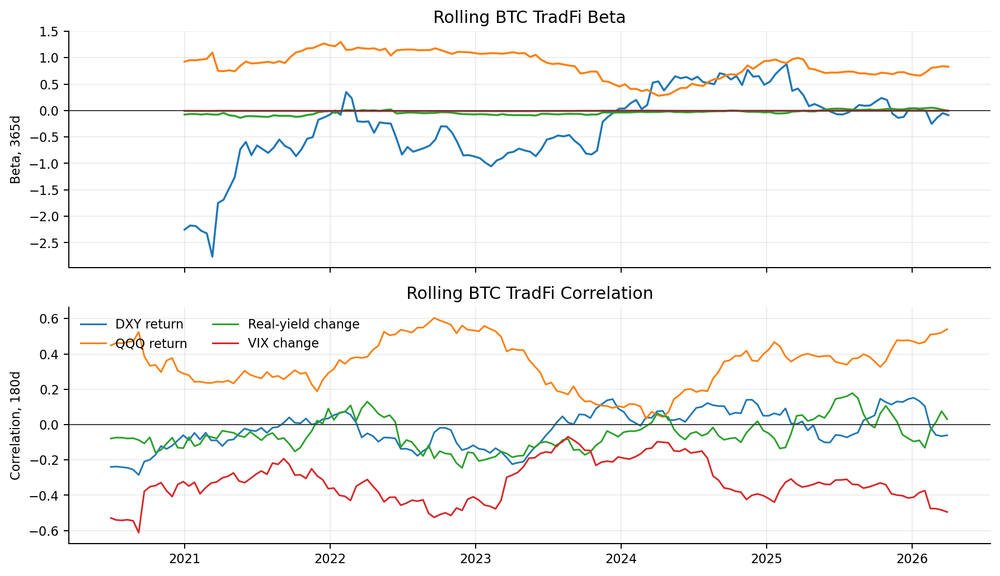
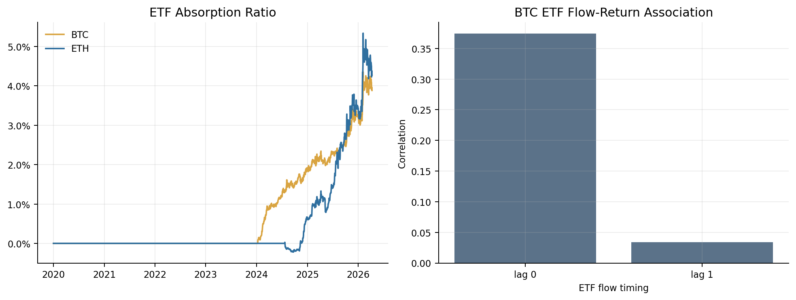
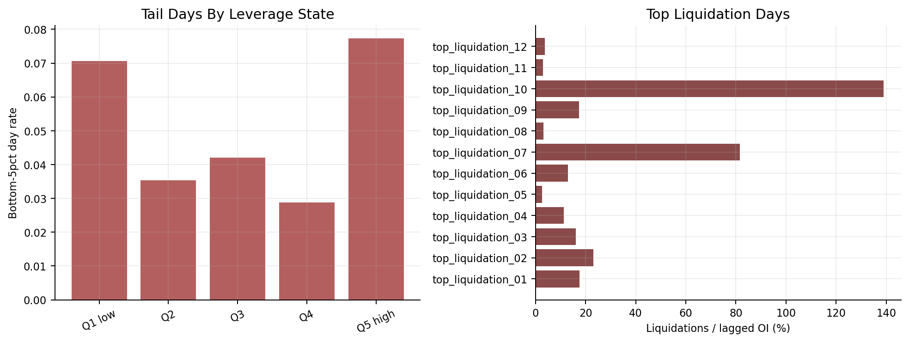
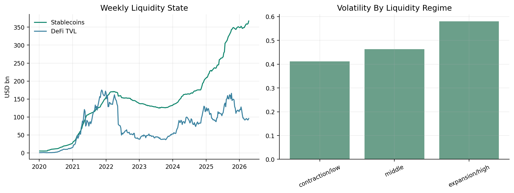
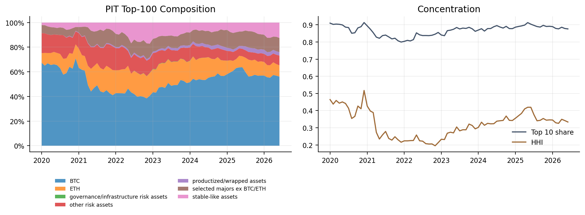
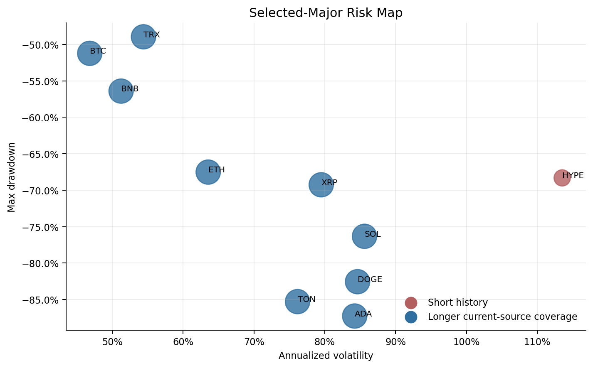
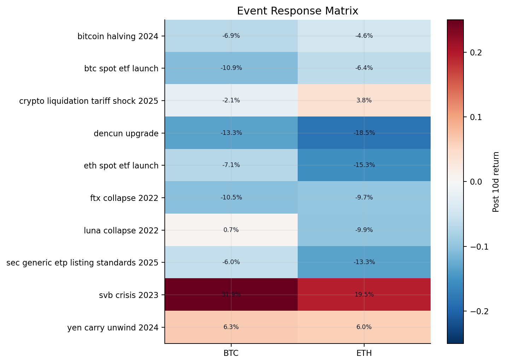

# Crypto Market Dynamics

## Factor, Liquidity, Leverage, and Market-Structure Research

Crypto Market Dynamics is a reproducible research-code project studying how crypto market behavior evolved from 2020-2026 across native valuation state, macro integration, ETF access, leverage, stablecoin/DeFi liquidity, selected major assets, point-in-time market structure, and event responses.

The project is descriptive. It is not a price-forecasting system, trading strategy, or causal-identification claim.

## Research Questions

1. How mechanically linked are MVRV and holder-profit metrics to BTC price/returns?
2. After removing mechanically linked valuation-state measures, how did BTC/ETH contemporaneous TradFi exposure and lagged-state associations evolve?
3. Are leverage and liquidation variables more informative for volatility/tail stress than average returns?
4. How did ETF access relate to market plumbing and risk integration?
5. How do stablecoin and DeFi liquidity states relate to volatility and concentration?
6. How do selected major assets differ in volatility, drawdown, beta, and event response?
7. How did PIT market composition, concentration, and turnover evolve?

## Results At A Glance

| question                   | finding                                                                                             | key_statistic                                                                      | sample_frequency                  | evidence_grade   | interpretation                                                               | caveat                             | source_table                     |
|:---------------------------|:----------------------------------------------------------------------------------------------------|:-----------------------------------------------------------------------------------|:----------------------------------|:-----------------|:-----------------------------------------------------------------------------|:-----------------------------------|:---------------------------------|
| MVRV mechanics             | MVRV is retained as a mechanically price-linked valuation-state diagnostic.                         | 0.9932                                                                             | 2020-2026 daily                   | B                | Use lagged state regimes; exclude same-day MVRV from primary BTC/ETH models. | Mechanical target overlap.         | mvrv_mechanical_link_audit.csv   |
| Ex-MVRV exposure evolution | BTC/ETH exposure tables split contemporaneous TradFi, lagged-state, and ETF-era augmented families. | ETH daily btc_etf_era equity_beta delta R2=0.1076, n=436, 2024-01-11 to 2026-04-10 | effective sample reported per row | B                | Feature blocks are descriptive exposures, not forecasts.                     | Collinearity and short ETF sample. | block_delta_r2.csv               |
| Leverage and tail stress   | Derivatives variables are framed as stress and volatility-state diagnostics.                        | Q5 high bottom-5pct day rate=7.73%, n=453                                          | daily                             | B                | Lagged state differs from contemporaneous liquidation signature.             | No initiation-cause claim.         | leverage_tail_risk_summary.csv   |
| PIT market structure       | PIT monthly snapshots support composition, concentration, and turnover evidence.                    | 2026-06-01 top10 share=87.64%, HHI=0.334                                           | monthly                           | A                | Use for market structure only.                                               | No daily PIT performance.          | pit_market_structure_summary.csv |


## Data

The build uses local curated data under `Data/`: CryptoQuant, Artemis, DefiLlama, FRED, Farside, TradingView, AlternativeMe/CMC, and a monthly DefiLlama PIT market-universe file. Data-use caveats are separated in [DATA_LICENSE.md](DATA_LICENSE.md), but that file does not resolve provider redistribution rights. Source coverage is summarized in [data_source_coverage.csv](outputs/tables/data_source_coverage.csv), and provider release risk is classified in [provider_data_disposition.csv](outputs/tables/provider_data_disposition.csv).

## MVRV Mechanics And On-Chain State



MVRV is a valuation-state diagnostic with mechanical price-state content. Same-day `d_log_mvrv` is excluded from the primary BTC/ETH exposure models; lagged MVRV state appears as conditioning context. The audit reports same-interval identity residuals and a residual-to-return scale comparison.

Source: [mvrv_mechanical_link_audit.csv](outputs/tables/mvrv_mechanical_link_audit.csv)

## BTC/ETH Ex-MVRV Exposure Evolution



The exposure tables split economically distinct families: contemporaneous TradFi co-movement models, lagged-state association models, and ETF-era augmented market-plumbing models. Every full/reduced comparison uses one complete-case sample with same-support checks. Drop-block delta R-squared is reported separately from conventional partial R-squared.



Source: [block_delta_r2.csv](outputs/tables/block_delta_r2.csv), [rolling_tradfi_exposures.csv](outputs/tables/rolling_tradfi_exposures.csv)

## ETF Institutionalization And Market Plumbing



ETF flows are market-plumbing variables with reporting-timing caveats. ETF-era augmented models include flow intensity separately at lag 0 and lag 1. Flow-return grids and absorption ratios are descriptive associations, not causal valuation statements.

Source: [etf_market_plumbing_summary.csv](outputs/tables/etf_market_plumbing_summary.csv)

## Leverage And Liquidation Stress



Leverage, funding, OI, and liquidation variables are evaluated as stress and volatility-state measures. Lagged leverage/funding/OI states are separated from same-day liquidation signatures and post-event responses. Liquidations are shown as percent of prior-day OI or basis points of prior-day market cap.

Source: [leverage_tail_risk_summary.csv](outputs/tables/leverage_tail_risk_summary.csv)

## Stablecoin And DeFi Liquidity



Stablecoin and DeFi metrics are weekly liquidity-state proxies. Weekly transformations use summed log returns, week-end levels, week-end level changes, weekly flow scaling, and prior week-end state where applicable. The project does not call changes exogenous liquidity shocks.

Source: [stablecoin_defi_liquidity_summary.csv](outputs/tables/stablecoin_defi_liquidity_summary.csv)

## Point-In-Time Market Structure



The monthly PIT top-200 source is used for composition, concentration, and turnover. It is not used for daily historical altseason performance.

Source: [pit_market_structure_summary.csv](outputs/tables/pit_market_structure_summary.csv)

## Selected Major Assets



Selected major assets use canonical IDs and explicit coverage windows. Current daily constituent coverage begins 2022-12-31/2023 for most selected assets, HYPE is short-history, and Toncoin is sourced only from the canonical `coingecko:the-open-network` local series when present. Comparable-window metrics are reported separately.

Source: [selected_major_risk_metrics.csv](outputs/tables/selected_major_risk_metrics.csv)

## Cycle And Event Atlas



Event windows are descriptive empirical placebo-window tests. The post-10-day convention is `+1` through `+10`, placebo windows have the same block length, and registered-event overlaps are excluded. The small number of events is not enough for forecast rules or causal structural claims.

Source: [event_response_matrix.csv](outputs/tables/event_response_matrix.csv)

## Methods And Evidence Standards

Public claims map to [evidence_ledger.csv](outputs/tables/evidence_ledger.csv) and claim dispositions are summarized in [claim_inventory.csv](outputs/tables/claim_inventory.csv). Evidence grades follow the project charter in [research_charter.md](docs/decisions/research_charter.md).

## Limitations

No causal claims are made. MVRV is a valuation-state diagnostic with mechanical price-state content. ETF and liquidation variables are timing-sensitive. Stablecoin/DeFi variables are proxies. Current-top50 daily cohort analysis is exploratory and survivorship-biased. True PIT historical altseason performance is deferred until constituent daily data exists. Provider data redistribution rights remain a public-release risk where marked uncertain/restricted.

## Reproduce

```powershell
uv sync --all-extras
uv run python scripts/run_all.py
uv run python scripts/check_public_surface.py
uv run pytest
uv run mypy src/cqresearch
uv run ruff check src/cqresearch scripts tests
```

## Repository Structure

- `Data/` curated local source data.
- `config/` asset, event, feature, and figure registries.
- `src/cqresearch/` maintained data, feature, modeling, analysis, reporting, visualization, and pipeline code.
- `scripts/` thin CLI entry points.
- `outputs/` generated public tables, figures, reports, and model cards.
- `docs/` methodology, data, architecture, and decisions.
- `archive/` historical material excluded from public indexing.
