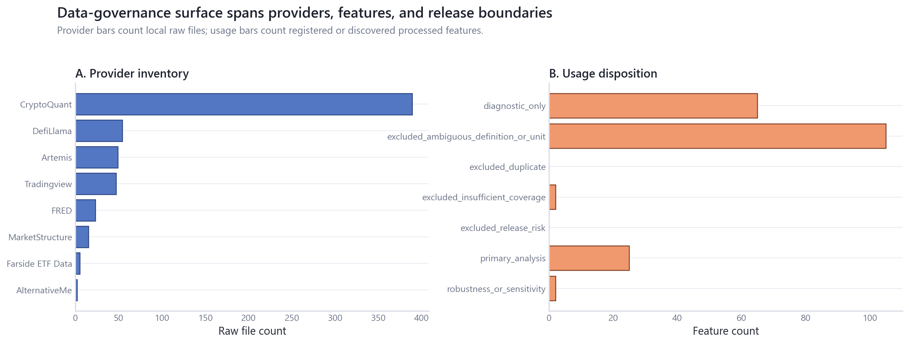
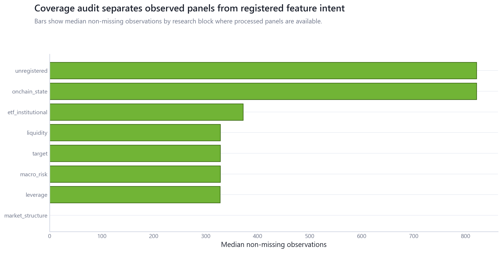

# 00_data_measurement_foundation: Data and Measurement Foundation

## Overview

This module is the repository's data-governance and measurement-control layer. It inventories local provider files, processed panels, registered features, selected assets, timing, units, denominators, release risk, and measurement constraints before any empirical claim is promoted.

## Questions Investigated

- Which provider groups and raw files are locally available, and what may be published?
- Which features are admissible for primary analysis, robustness, diagnostics, or exclusion?
- Which assets and token mappings are defensible for cross-asset and point-in-time analysis?
- Where do mechanical price links, valuation contamination, timing, and denominator risks constrain interpretation?

## Data, Assets, and Sample

| surface             |   observations | sample                            | coverage rule                                     |
|:--------------------|---------------:|:----------------------------------|:--------------------------------------------------|
| Raw provider files  |            584 | 1947-01-01 to 2026-06-18          | local files under data_local/raw; never committed |
| Registered features |             31 | config/feature_registry.yml       | feature must receive exactly one usage status     |
| Selected assets     |             10 | canonical selected-major universe | current-cohort daily is survivorship-biased       |

## Methodologies and Calculations

| method                 | calculation                                                                     | output                                           |
|:-----------------------|:--------------------------------------------------------------------------------|:-------------------------------------------------|
| File inventory         | scan local raw files and infer provider/date coverage                           | raw_file_inventory.csv; raw_series_inventory.csv |
| Usage disposition      | assign one allowed status from registration, coverage, unit, and release risk   | feature_usage_matrix.csv                         |
| Measurement-risk audit | flag release, mechanical-link, valuation, endogeneity, and asset-coverage risks | measurement_risk_audit.csv                       |

## Formulas

Missingness is measured as $\text{missing pct} = \frac{N_{missing}}{N_{rows}}$.

Feature usage is a deterministic one-status assignment over the union of registered features and discovered processed-panel columns.

## Summary of Results

| result                 | estimate                                              | interval                                    |   N/sample | interpretation                                                        | sensitivity                                      |
|:-----------------------|:------------------------------------------------------|:--------------------------------------------|-----------:|:----------------------------------------------------------------------|:-------------------------------------------------|
| Provider groups        | 8                                                     | deterministic file inventory                |        584 | 7 provider groups require derived-only or restricted handling.        | rerun after adding/removing local provider files |
| Feature usage status   | 25 primary, 2 robustness, 65 diagnostic, 107 excluded | rule-based status taxonomy                  |        199 | Every registered or discovered processed feature has one disposition. | registration and coverage thresholds             |
| Measurement-risk flags | 145                                                   | automated audit plus manual review required |         31 | Flags constrain public language and model eligibility.                | provider license review and feature metadata     |

## Analytical Results and Visualizations



The first panel shows the local provider inventory that supports private rebuilds; the second panel shows whether discovered features are primary, sensitivity, diagnostic, or excluded. Release risk is a publishing constraint, not evidence quality.



Coverage varies sharply by research block, so later modules state matched samples rather than assuming every registered feature is usable everywhere.

## Robustness and Sensitivity

The inventory is deterministic conditional on local files. Statuses should be regenerated after any new data source, feature-registration change, or provider-rights review.

## Interpretation

A `primary_analysis` status means the current repository permits use under the descriptive design. It does not mean the variable is strong, exogenous, or suitable for causal language. Diagnostics-only fields explain measurement, timing, identity, or units.

## Limitations

File inspection cannot grant legal redistribution rights. Unregistered processed columns remain conservative until promoted by a documented module decision. Current-cohort daily selected-major data is survivorship-biased.

## Reproduce This Module

```bash
uv run python scripts/run_research.py --module 00_data_measurement_foundation
uv run python scripts/check_research_surface.py --module 00_data_measurement_foundation
```

## Files and Code

- [`provider_inventory.csv`](tables/provider_inventory.csv)
- [`raw_file_inventory.csv`](tables/raw_file_inventory.csv)
- [`raw_series_inventory.csv`](tables/raw_series_inventory.csv)
- [`feature_inventory.csv`](tables/feature_inventory.csv)
- [`feature_usage_matrix.csv`](tables/feature_usage_matrix.csv)
- [`asset_universe_audit.csv`](tables/asset_universe_audit.csv)
- [`chain_token_mapping_audit.csv`](tables/chain_token_mapping_audit.csv)
- [`coverage_missingness.csv`](tables/coverage_missingness.csv)
- [`units_timing_scaling_audit.csv`](tables/units_timing_scaling_audit.csv)
- [`measurement_risk_audit.csv`](tables/measurement_risk_audit.csv)
- [`claims.csv`](tables/claims.csv)

- [Methodology](methodology.md)
- [Findings](findings.md)
- [Interpretation](interpretation.md)
- [Limitations](limitations.md)
- Code: `src/cqresearch/research/data_foundation.py`
