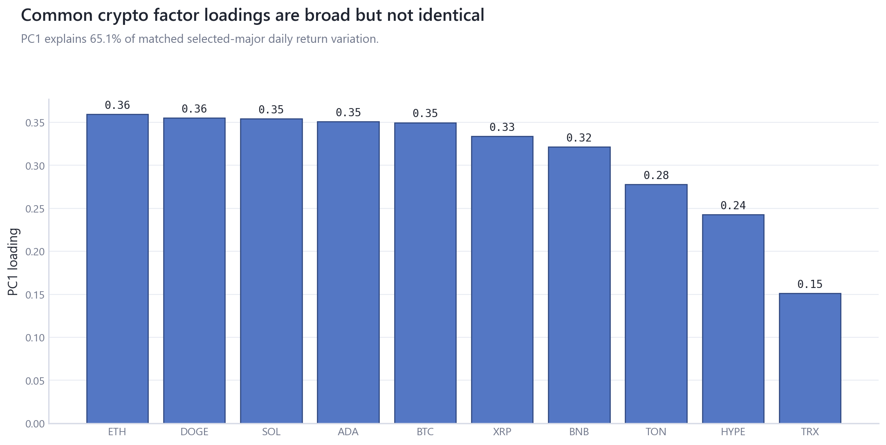
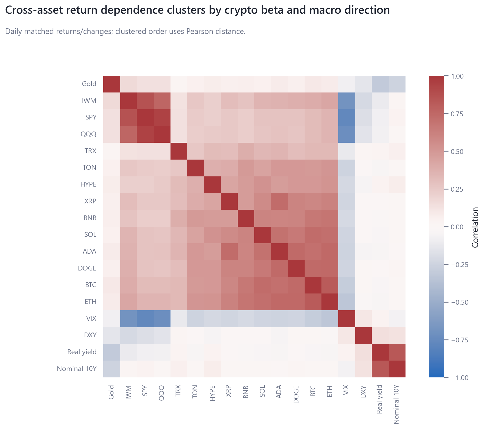
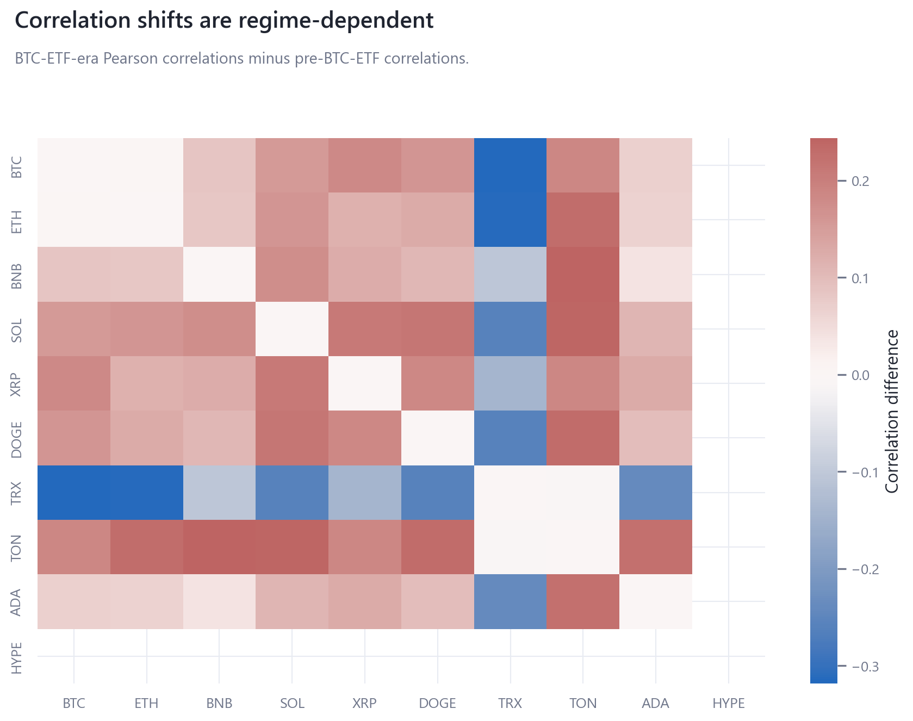

# 01_cross_asset_dependence_regimes: Cross-Asset Dependence and Regimes

## Overview

This module replaces the former BTC/ETH returns-regime scaffold with a multi-asset dependence analysis spanning selected crypto majors and verified TradFi/macro return or change series.

## Questions Investigated

- How broad is common-factor crypto dependence across the selected-major universe?
- How do Pearson, Spearman, partial, lower-tail, rolling, and regime-difference dependence diagnostics compare?

## Data, Assets, and Sample

| artifact                                   |   rows | sample                             | coverage rule                                |
|:-------------------------------------------|-------:|:-----------------------------------|:---------------------------------------------|
| tables/asset_return_coverage.csv           |     18 | 2020-01-03 to 2026-06-16, n=18     | module-specific matched sample               |
| tables/lower_tail_coexceedance_matrix.csv  |     10 | rows=10                            | module-specific matched sample               |
| tables/multi_asset_descriptive_stats.csv   |     10 | 2023-01-01 to 2026-06-16, n=10     | module-specific matched sample               |
| tables/partial_correlation_btc_control.csv |     36 | rows=36                            | module-specific matched sample               |
| tables/pca_common_factor_loadings.csv      |     10 | rows=10                            | matched current-cohort selected-major window |
| tables/pca_scores.csv                      |    563 | 2024-11-30 to 2026-06-16, rows=563 | module-specific matched sample               |
| tables/pca_variance_share.csv              |     10 | 2024-11-30 to 2026-06-16, n=10     | module-specific matched sample               |
| tables/pearson_correlation_matrix.csv      |     18 | rows=18                            | module-specific matched sample               |
| tables/regime_correlation_difference.csv   |     10 | rows=10                            | module-specific matched sample               |
| tables/rolling_dependence_summary.csv      |      9 | 2025-05-28 to 2026-06-16, n=9      | module-specific matched sample               |
| tables/spearman_correlation_matrix.csv     |     18 | rows=18                            | module-specific matched sample               |

## Methodologies and Calculations

| method               | calculation                                                                                                 |
|:---------------------|:------------------------------------------------------------------------------------------------------------|
| Correlation matrices | Pearson and Spearman correlations are computed on matched daily observations with explicit coverage tables. |
| PCA/common factor    | standardized selected-major returns are decomposed with deterministic SVD.                                  |
| Tail dependence      | lower-tail co-exceedance counts joint bottom-5% days for each pair.                                         |

## Formulas

$\rho_{ij}=\operatorname{corr}(r_i,r_j)$.

$\text{PC share}_k = s_k^2 / \sum_j s_j^2$ from the standardized return matrix.

$\text{co-exceed}_{ij}=N^{-1}\sum_t 1[r_{i,t}\le q_i(0.05), r_{j,t}\le q_j(0.05)]$.

## Summary of Results

| finding                             | estimate                       | interval                                | N/sample                        | interpretation                                                                | sensitivity                                                                   |
|:------------------------------------|:-------------------------------|:----------------------------------------|:--------------------------------|:------------------------------------------------------------------------------|:------------------------------------------------------------------------------|
| Matched selected-major crypto panel | 10 assets; PC1 explains 65.1%  | descriptive PCA, no confidence interval | 2024-11-30 to 2026-06-16, n=563 | A common crypto factor dominates matched-window variation.                    | Pearson, Spearman, BTC-control partial correlations, lower-tail co-exceedance |
| Lower-tail dependence               | median pair co-exceedance 2.6% | empirical bottom-5% thresholds          | 2024-11-30 to 2026-06-16, n=563 | Tail co-movement is reported as joint stress frequency, not a causal channel. | threshold can be varied in source table construction                          |

## Analytical Results and Visualizations



PC1 loadings summarize the common crypto factor; signs are normalized for readability and have no standalone economic direction.



The heatmap uses matched daily returns/changes and clusters assets by correlation distance. It is a dependence map, not a forecast or allocation rule.



The regime-difference heatmap compares the BTC-ETF era with the earlier sample on the same selected-major assets where coverage overlaps.

## Robustness and Sensitivity

Sensitivity dimensions are: Pearson/Spearman, BTC-control partial correlations, regime split, tail threshold, rolling window. Tables report matched samples, frequencies, and timing conventions where available.

## Interpretation

Dependence results describe realized co-movement and common-factor structure. They do not imply investability, forecasts, or causal transmission.

## Limitations

Selected-major daily data uses a current-cohort source and is survivorship-biased. TradFi variables use available close alignment and should be interpreted as contemporaneous co-movement.

## Reproduce This Module

```bash
uv run python scripts/run_research.py --module 01_cross_asset_dependence_regimes
uv run python scripts/build_research_figures.py --module 01_cross_asset_dependence_regimes
uv run python scripts/check_research_surface.py --module 01_cross_asset_dependence_regimes
```

## Files and Code

- [`asset_return_coverage.csv`](tables/asset_return_coverage.csv)
- [`claims.csv`](tables/claims.csv)
- [`lower_tail_coexceedance_matrix.csv`](tables/lower_tail_coexceedance_matrix.csv)
- [`multi_asset_descriptive_stats.csv`](tables/multi_asset_descriptive_stats.csv)
- [`partial_correlation_btc_control.csv`](tables/partial_correlation_btc_control.csv)
- [`pca_common_factor_loadings.csv`](tables/pca_common_factor_loadings.csv)
- [`pca_scores.csv`](tables/pca_scores.csv)
- [`pca_variance_share.csv`](tables/pca_variance_share.csv)
- [`pearson_correlation_matrix.csv`](tables/pearson_correlation_matrix.csv)
- [`regime_correlation_difference.csv`](tables/regime_correlation_difference.csv)
- [`rolling_dependence_summary.csv`](tables/rolling_dependence_summary.csv)
- [`spearman_correlation_matrix.csv`](tables/spearman_correlation_matrix.csv)

- [Methodology](methodology.md)
- [Findings](findings.md)
- [Interpretation](interpretation.md)
- [Limitations](limitations.md)
- Code: `src/cqresearch/research/analytical_modules.py`
