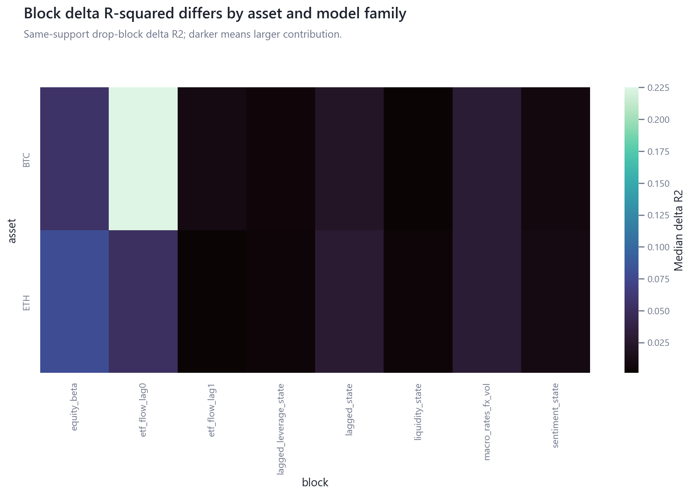
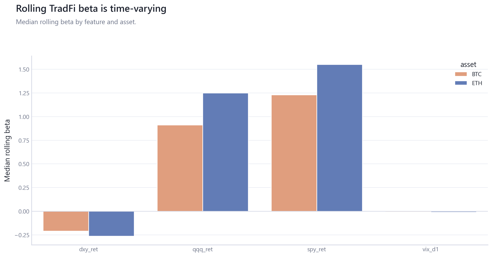

# 02_macro_tradfi_integration: Macro and TradFi Integration

## Overview

This module estimates BTC/ETH co-movement with equities, volatility, rates, the dollar, gold, and credit using synchronized calendars and same-support comparisons.

## Questions Investigated

- How do equity, volatility, dollar, rates, and gold blocks contribute to contemporaneous crypto exposure models?
- Are later-sample exposure differences robust to frequency, multicollinearity, FDR, and ridge sensitivity?

## Data, Assets, and Sample

| artifact                                         |   rows | sample                              | coverage rule                                      |
|:-------------------------------------------------|-------:|:------------------------------------|:---------------------------------------------------|
| tables/block_delta_r2.csv                        |     54 | 2020-01-03 to 2026-04-12, n=54      | module-specific matched sample                     |
| tables/btc_ex_mvrv_feature_strength.csv          |     95 | 2020-01-03 to 2026-04-12, n=95      | measurement mechanics and lagged-state diagnostics |
| tables/conventional_partial_r2.csv               |     54 | 2020-01-03 to 2026-04-12, n=54      | module-specific matched sample                     |
| tables/eth_feature_strength.csv                  |     91 | 2020-01-03 to 2026-04-12, n=91      | module-specific matched sample                     |
| tables/exposure_regime_comparison.csv            |      6 | rows=6                              | module-specific matched sample                     |
| tables/fdr_adjusted_inference.csv                |    186 | 2020-01-03 to 2026-04-12, n=186     | module-specific matched sample                     |
| tables/frequency_robustness.csv                  |     20 | 2020-01-03 to 2026-04-12, n=20      | module-specific matched sample                     |
| tables/local_window_correlation_distribution.csv |      4 | rows=4                              | module-specific matched sample                     |
| tables/multicollinearity_diagnostics.csv         |    186 | rows=186                            | module-specific matched sample                     |
| tables/ridge_stability.csv                       |    744 | rows=744                            | module-specific matched sample                     |
| tables/rolling_exposure_summary.csv              |     30 | rows=30                             | module-specific matched sample                     |
| tables/rolling_tradfi_exposures.csv              |   4048 | 2020-06-30 to 2026-04-03, rows=4048 | module-specific matched sample                     |

## Methodologies and Calculations

| method                       | calculation                                                                      |
|:-----------------------------|:---------------------------------------------------------------------------------|
| HAC OLS                      | synchronized daily and weekly panels estimate contemporaneous exposure models.   |
| Same-support block R-squared | full and reduced models use identical complete-case rows.                        |
| Stability diagnostics        | VIF, condition number, ridge paths, FDR q-values, and rolling beta are reported. |

## Formulas

$\Delta R^2_b = R^2_{full} - R^2_{reduced(-b)}$ on the same support.

$R^2_{partial}=(SSE_{reduced}-SSE_{full})/SSE_{reduced}$.

## Summary of Results

| finding                                      | estimate                                                                                                                           | interval                                     | N/sample                       | interpretation                                                                   | sensitivity                                 |
|:---------------------------------------------|:-----------------------------------------------------------------------------------------------------------------------------------|:---------------------------------------------|:-------------------------------|:---------------------------------------------------------------------------------|:--------------------------------------------|
| Equity block exposure changes across periods | BTC pre_btc_etf delta R2=0.0249; BTC btc_etf_era delta R2=0.0884; ETH pre_btc_etf delta R2=0.0193; ETH btc_etf_era delta R2=0.1076 | HAC model rows and same-support block deltas | 2020-01-03 to 2026-04-12, n=54 | Period comparison of contemporaneous co-movement, not an ETF attribution design. | daily/weekly, FDR, VIF, ridge, rolling beta |

## Analytical Results and Visualizations



The heatmap compares block-level contributions across assets, frequencies, regimes, and model families.



Rolling beta summaries show how QQQ/SPY exposure estimates vary through time; they are contemporaneous co-movement diagnostics.


Grouped bars show same-support equity-block delta R-squared for BTC and ETH across pre-BTC-ETF and BTC-ETF-era windows.

## Robustness and Sensitivity

Sensitivity dimensions are: frequency, period split, HAC bandwidth, FDR, VIF, ridge. Tables report matched samples, frequencies, and timing conventions where available.

## Interpretation

Macro/TradFi integration is contemporaneous co-movement evidence, not macro causality or ETF-effect identification.

## Limitations

Business-date alignment, period splits, and rolling windows are descriptive. Same-day models cannot establish lead-lag direction.

## Reproduce This Module

```bash
uv run python scripts/run_research.py --module 02_macro_tradfi_integration
uv run python scripts/build_research_figures.py --module 02_macro_tradfi_integration
uv run python scripts/check_research_surface.py --module 02_macro_tradfi_integration
```

## Files and Code

- [`block_delta_r2.csv`](tables/block_delta_r2.csv)
- [`btc_ex_mvrv_feature_strength.csv`](tables/btc_ex_mvrv_feature_strength.csv)
- [`claims.csv`](tables/claims.csv)
- [`conventional_partial_r2.csv`](tables/conventional_partial_r2.csv)
- [`eth_feature_strength.csv`](tables/eth_feature_strength.csv)
- [`exposure_regime_comparison.csv`](tables/exposure_regime_comparison.csv)
- [`fdr_adjusted_inference.csv`](tables/fdr_adjusted_inference.csv)
- [`frequency_robustness.csv`](tables/frequency_robustness.csv)
- [`local_window_correlation_distribution.csv`](tables/local_window_correlation_distribution.csv)
- [`multicollinearity_diagnostics.csv`](tables/multicollinearity_diagnostics.csv)
- [`ridge_stability.csv`](tables/ridge_stability.csv)
- [`rolling_exposure_summary.csv`](tables/rolling_exposure_summary.csv)
- [`rolling_tradfi_exposures.csv`](tables/rolling_tradfi_exposures.csv)

- [Methodology](methodology.md)
- [Findings](findings.md)
- [Interpretation](interpretation.md)
- [Limitations](limitations.md)
- Code: `src/cqresearch/research/analytical_modules.py`
