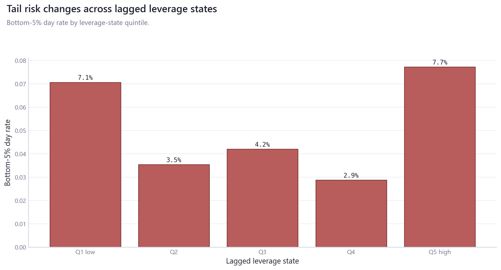
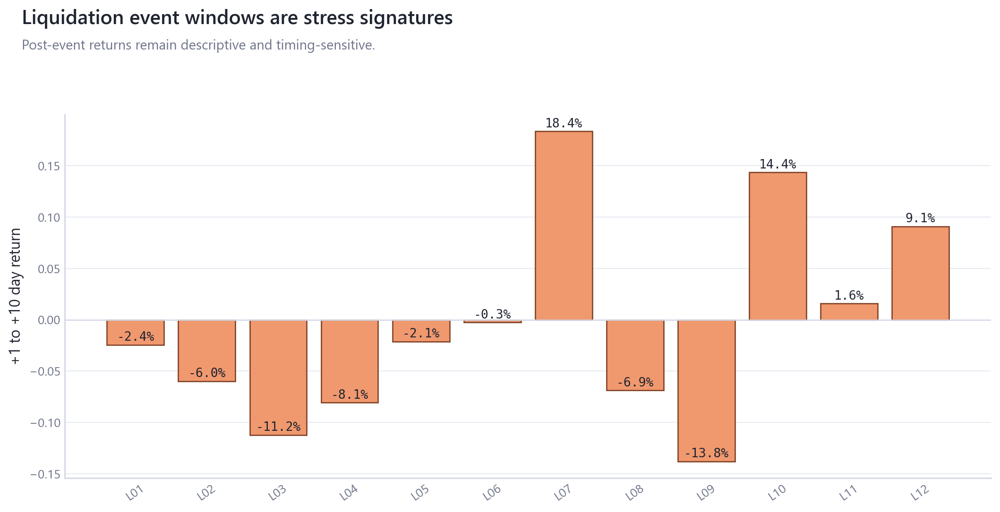

# 03_derivatives_leverage_liquidations: Derivatives, Leverage, and Liquidations

## Overview

This module studies lagged leverage, funding, open-interest scaling, and liquidation stress as state diagnostics for volatility and tail outcomes.

## Questions Investigated

- Where do lagged leverage states coincide with volatility and bottom-tail outcomes?
- How do liquidation event windows compare with stress-state summaries?

## Data, Assets, and Sample

| artifact                               |   rows | sample   | coverage rule                  |
|:---------------------------------------|-------:|:---------|:-------------------------------|
| tables/leverage_feature_registry.csv   |      7 | rows=7   | module-specific matched sample |
| tables/leverage_state_summary.csv      |      5 | rows=5   | module-specific matched sample |
| tables/leverage_tail_risk_summary.csv  |      5 | rows=5   | module-specific matched sample |
| tables/liquidation_event_responses.csv |     12 | rows=12  | module-specific matched sample |
| tables/tail_risk_models.csv            |      4 | rows=4   | module-specific matched sample |

## Methodologies and Calculations

| method           | calculation                                                             |
|:-----------------|:------------------------------------------------------------------------|
| State bins       | leverage metrics are lagged before quintile/state assignment.           |
| Tail diagnostics | bottom-tail rates and logit-style tail summaries are reported by state. |
| Event/placebo    | liquidation windows exclude same-day initiation signatures.             |

## Formulas

$\text{tail rate}_q = N_q^{-1}\sum_t 1[r_t \le Q_{0.05}]$.

$\text{liq intensity}=\text{liquidations}/\text{lagged OI or market cap}$.

## Summary of Results

| finding                    | estimate                        | interval                                  | N/sample   | interpretation                          | sensitivity                                                  |
|:---------------------------|:--------------------------------|:------------------------------------------|:-----------|:----------------------------------------|:-------------------------------------------------------------|
| Leverage-state tail stress | Q5 high bottom-5% day rate=7.7% | state-bin empirical rates and tail models | rows=5     | Leverage states are stress diagnostics. | state bins, lags, denominator scaling, event/placebo windows |

## Analytical Results and Visualizations



The state surface separates tail-day rates from realized-volatility medians across leverage bins.


The root candidate shows bottom-tail frequency and realized volatility by lagged leverage state.



Liquidation event bars summarize post-event windows; they are descriptive signatures, not causal evidence.

## Robustness and Sensitivity

Sensitivity dimensions are: state bins, lags, tail threshold, denominator scaling, event windows. Tables report matched samples, frequencies, and timing conventions where available.

## Interpretation

Derivatives variables are stress-state diagnostics. They are not trading rules and do not establish directional liquidation attribution.

## Limitations

Liquidation timestamps, denominator price content, and same-day simultaneity constrain interpretation.

## Reproduce This Module

```bash
uv run python scripts/run_research.py --module 03_derivatives_leverage_liquidations
uv run python scripts/build_research_figures.py --module 03_derivatives_leverage_liquidations
uv run python scripts/check_research_surface.py --module 03_derivatives_leverage_liquidations
```

## Files and Code

- [`claims.csv`](tables/claims.csv)
- [`leverage_feature_registry.csv`](tables/leverage_feature_registry.csv)
- [`leverage_state_summary.csv`](tables/leverage_state_summary.csv)
- [`leverage_tail_risk_summary.csv`](tables/leverage_tail_risk_summary.csv)
- [`liquidation_event_responses.csv`](tables/liquidation_event_responses.csv)
- [`tail_risk_models.csv`](tables/tail_risk_models.csv)

- [Methodology](methodology.md)
- [Findings](findings.md)
- [Interpretation](interpretation.md)
- [Limitations](limitations.md)
- Code: `src/cqresearch/research/analytical_modules.py`
