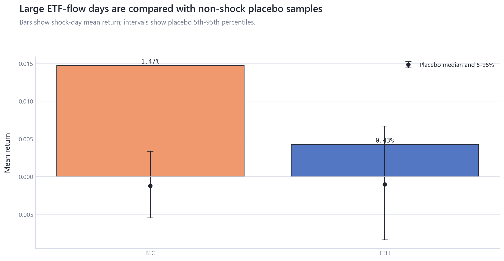
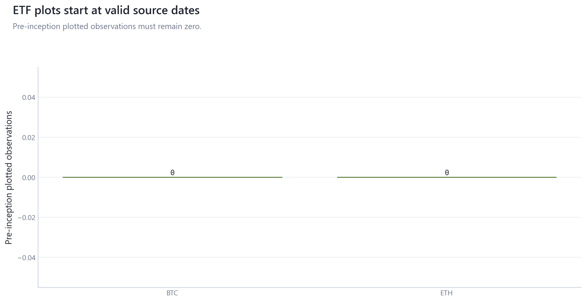

# 04_etf_institutional_flows: ETF and Institutional Flows

## Overview

This module replaces the old cumulative-flow root figure with ETF lag-response, source-timing, and flow-shock/placebo diagnostics.

## Questions Investigated

- How do BTC and ETH ETF flow-intensity associations vary over lags 0-5?
- Do plotted ETF series begin only at valid source observations?

## Data, Assets, and Sample

| artifact                                |   rows | sample                              | coverage rule                                    |
|:----------------------------------------|-------:|:------------------------------------|:-------------------------------------------------|
| tables/etf_absorption_metrics.csv       |   2293 | 2020-01-01 to 2026-04-11, rows=2293 | ETF source rows only; no pre-inception zero fill |
| tables/etf_data_timing_audit.csv        |      2 | rows=2                              | ETF source rows only; no pre-inception zero fill |
| tables/etf_era_exposure_comparison.csv  |     18 | 2024-01-12 to 2026-04-10, n=18      | ETF source rows only; no pre-inception zero fill |
| tables/etf_flow_associations.csv        |      4 | rows=4                              | ETF source rows only; no pre-inception zero fill |
| tables/etf_flow_shock_days.csv          |     50 | 2024-10-29 to 2026-03-04, rows=50   | ETF source rows only; no pre-inception zero fill |
| tables/etf_flow_shock_placebo.csv       |      2 | 2024-01-12 to 2026-04-10, n=2       | ETF source rows only; no pre-inception zero fill |
| tables/etf_lag_response.csv             |     12 | 2024-01-12 to 2026-04-10, n=12      | ETF source rows only; no pre-inception zero fill |
| tables/etf_market_plumbing_summary.csv  |      2 | rows=2                              | ETF source rows only; no pre-inception zero fill |
| tables/etf_pre_inception_plot_audit.csv |      2 | rows=2                              | ETF source rows only; no pre-inception zero fill |

## Methodologies and Calculations

| method                 | calculation                                                              |
|:-----------------------|:-------------------------------------------------------------------------|
| Lag response           | ETF net flows are scaled by lagged market cap and shifted over lags 0-5. |
| Moving-block bootstrap | deterministic block resampling produces correlation intervals.           |
| Timing audit           | first plotted dates must equal or follow first valid source dates.       |

## Formulas

$f_t=\text{ETF net flow}_t/\text{market cap}_{t-1}$.

$\rho_l=\operatorname{corr}(r_t, f_{t-l})$ for lags $l=0,\dots,5$.

## Summary of Results

| finding               | estimate                            | interval                                       | N/sample                       | interpretation                                                           | sensitivity                                           |
|:----------------------|:------------------------------------|:-----------------------------------------------|:-------------------------------|:-------------------------------------------------------------------------|:------------------------------------------------------|
| ETF lag-response grid | BTC lag 0 corr=0.379 [0.313, 0.453] | deterministic moving-block bootstrap intervals | 2024-01-12 to 2026-04-10, n=12 | Flow intensity is market plumbing with timing and simultaneity concerns. | lags 0-5, BTC/ETH separate starts, flow-shock placebo |

## Analytical Results and Visualizations



Shock days compare large absolute flow-intensity days with deterministic non-shock placebo samples.


This replaces the old cumulative-flow figure. BTC and ETH use only valid source rows and show lag 0-5 associations with intervals.



The timing audit confirms plotted rows begin at the first valid source observation for each asset.

## Robustness and Sensitivity

Sensitivity dimensions are: lags 0-5, BTC/ETH separate starts, block-bootstrap interval, shock threshold. Tables report matched samples, frequencies, and timing conventions where available.

## Interpretation

ETF flows are market-plumbing associations with timing and simultaneity concerns, not causal return estimates.

## Limitations

Issuer flow timing, non-reporting days, holidays, and launch-date differences require asset-specific samples.

## Reproduce This Module

```bash
uv run python scripts/run_research.py --module 04_etf_institutional_flows
uv run python scripts/build_research_figures.py --module 04_etf_institutional_flows
uv run python scripts/check_research_surface.py --module 04_etf_institutional_flows
```

## Files and Code

- [`claims.csv`](tables/claims.csv)
- [`etf_absorption_metrics.csv`](tables/etf_absorption_metrics.csv)
- [`etf_data_timing_audit.csv`](tables/etf_data_timing_audit.csv)
- [`etf_era_exposure_comparison.csv`](tables/etf_era_exposure_comparison.csv)
- [`etf_flow_associations.csv`](tables/etf_flow_associations.csv)
- [`etf_flow_shock_days.csv`](tables/etf_flow_shock_days.csv)
- [`etf_flow_shock_placebo.csv`](tables/etf_flow_shock_placebo.csv)
- [`etf_lag_response.csv`](tables/etf_lag_response.csv)
- [`etf_market_plumbing_summary.csv`](tables/etf_market_plumbing_summary.csv)
- [`etf_pre_inception_plot_audit.csv`](tables/etf_pre_inception_plot_audit.csv)

- [Methodology](methodology.md)
- [Findings](findings.md)
- [Interpretation](interpretation.md)
- [Limitations](limitations.md)
- Code: `src/cqresearch/research/analytical_modules.py`
