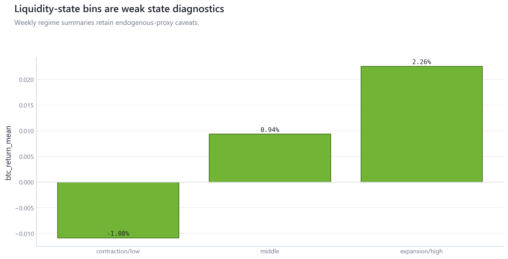
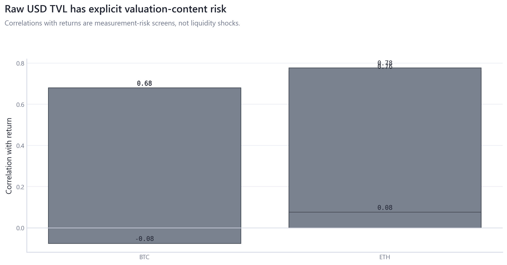
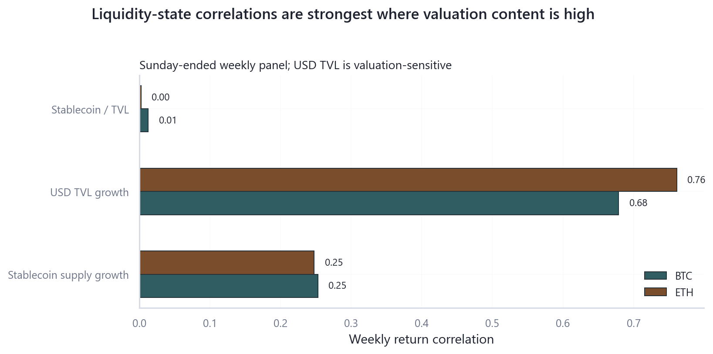

# 05_stablecoin_defi_liquidity: Stablecoin and DeFi Liquidity State

## Overview

This module treats stablecoin supply, DeFi TVL, and related balances as endogenous liquidity-state proxies with explicit valuation-contamination checks.

## Questions Investigated

- Which stablecoin/DeFi state variables have usable weekly coverage?
- How much raw USD TVL behavior is plausibly valuation-sensitive?

## Data, Assets, and Sample

| artifact                                     |   rows | sample                             | coverage rule                  |
|:---------------------------------------------|-------:|:-----------------------------------|:-------------------------------|
| tables/defi_activity_features.csv            |    328 | 2020-01-05 to 2026-04-12, rows=328 | module-specific matched sample |
| tables/liquidity_associations.csv            |      9 | rows=9                             | module-specific matched sample |
| tables/liquidity_regime_summary.csv          |      3 | rows=3                             | module-specific matched sample |
| tables/stablecoin_defi_liquidity_summary.csv |      3 | rows=3                             | module-specific matched sample |
| tables/stablecoin_liquidity_features.csv     |    328 | 2020-01-05 to 2026-04-12, rows=328 | module-specific matched sample |
| tables/valuation_contamination_audit.csv     |      6 | rows=6                             | module-specific matched sample |

## Methodologies and Calculations

| method                  | calculation                                                           |
|:------------------------|:----------------------------------------------------------------------|
| Weekly state analysis   | Sunday-ended weekly growth and lagged state variables are summarized. |
| Valuation contamination | raw USD TVL growth is screened against BTC/ETH returns.               |

## Formulas

$\Delta \log X_t = \log X_t - \log X_{t-1}$.

$\operatorname{corr}(r_t, \Delta \log TVL_t)$ is a price-content screen, not a liquidity shock.

## Summary of Results

| finding                         | estimate                  | interval                                       | N/sample   | interpretation                                                                             | sensitivity                                                   |
|:--------------------------------|:--------------------------|:-----------------------------------------------|:-----------|:-------------------------------------------------------------------------------------------|:--------------------------------------------------------------|
| Stablecoin/DeFi liquidity state | max TVL return corr=0.778 | weekly descriptive correlations and unit audit | rows=6     | Stablecoin/DeFi measures are endogenous state proxies; raw USD TVL is valuation-sensitive. | weekly calendar, lagged state, raw vs valuation-sensitive TVL |

## Analytical Results and Visualizations



Regime summaries show weekly state bins rather than claiming an exogenous liquidity shock.



The audit keeps raw USD TVL's price content visible before interpretation.



Correlation bars are shown with valuation-risk labels; weak relationships are not forced into the root README.

## Robustness and Sensitivity

Sensitivity dimensions are: raw versus lagged, TVL price content, weekly calendar, state bins. Tables report matched samples, frequencies, and timing conventions where available.

## Interpretation

Stablecoin/DeFi variables are balance-sheet state proxies. Weak or valuation-sensitive results are reported as weak and not forced into the root README.

## Limitations

Raw USD TVL can mechanically rise when deposited-asset prices rise. No exogenous liquidity-shock design is present.

## Reproduce This Module

```bash
uv run python scripts/run_research.py --module 05_stablecoin_defi_liquidity
uv run python scripts/build_research_figures.py --module 05_stablecoin_defi_liquidity
uv run python scripts/check_research_surface.py --module 05_stablecoin_defi_liquidity
```

## Files and Code

- [`claims.csv`](tables/claims.csv)
- [`defi_activity_features.csv`](tables/defi_activity_features.csv)
- [`liquidity_associations.csv`](tables/liquidity_associations.csv)
- [`liquidity_regime_summary.csv`](tables/liquidity_regime_summary.csv)
- [`stablecoin_defi_liquidity_summary.csv`](tables/stablecoin_defi_liquidity_summary.csv)
- [`stablecoin_liquidity_features.csv`](tables/stablecoin_liquidity_features.csv)
- [`valuation_contamination_audit.csv`](tables/valuation_contamination_audit.csv)

- [Methodology](methodology.md)
- [Findings](findings.md)
- [Interpretation](interpretation.md)
- [Limitations](limitations.md)
- Code: `src/cqresearch/research/analytical_modules.py`
