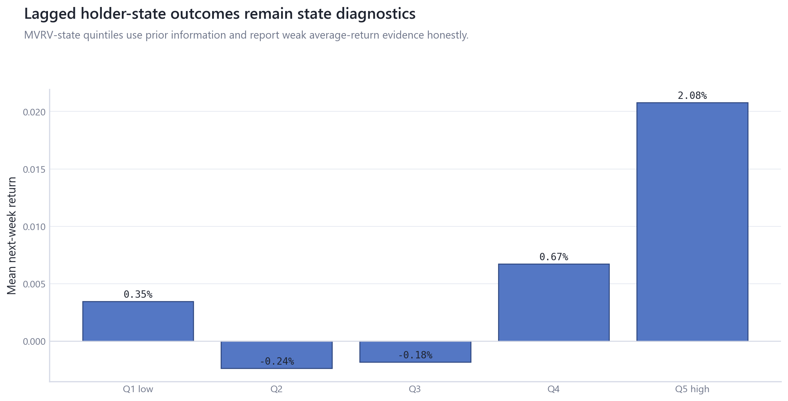
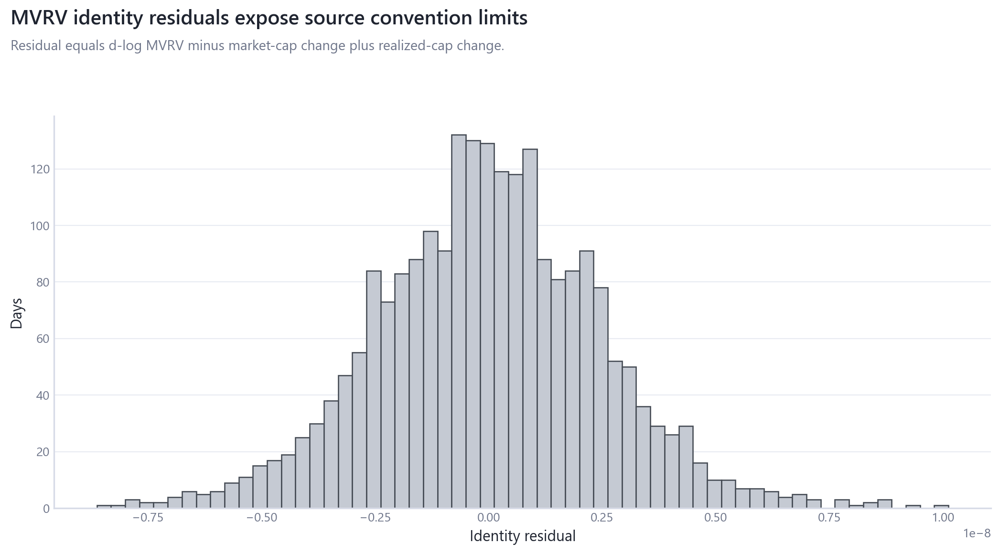
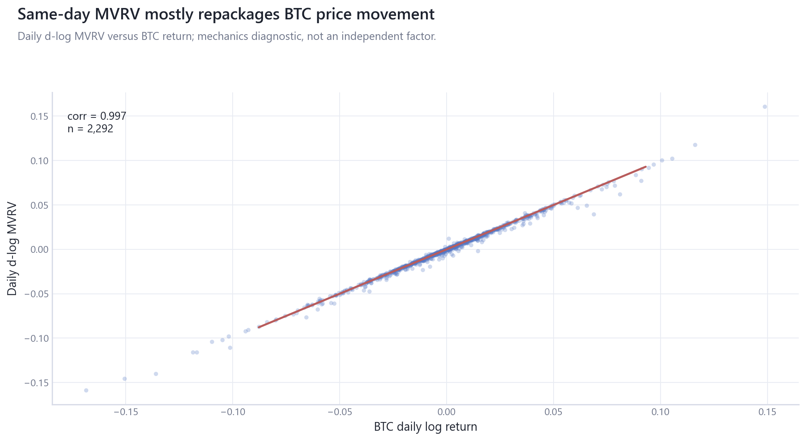

# 06_onchain_valuation_holder_behavior: On-Chain Valuation and Holder Behavior

## Overview

This module separates same-day on-chain measurement mechanics from lagged holder-state diagnostics.

## Questions Investigated

- How mechanically linked is same-day MVRV to BTC price-state changes?
- Do lagged holder-state summaries deserve diagnostic treatment without becoming primary factors?

## Data, Assets, and Sample

| artifact                              |   rows | sample                              | coverage rule                                      |
|:--------------------------------------|-------:|:------------------------------------|:---------------------------------------------------|
| tables/mvrv_identity_points.csv       |   2293 | 2020-01-01 to 2026-04-11, rows=2293 | measurement mechanics and lagged-state diagnostics |
| tables/mvrv_mechanical_link_audit.csv |     13 | rows=13                             | measurement mechanics and lagged-state diagnostics |
| tables/mvrv_regime_outcomes.csv       |      5 | rows=5                              | measurement mechanics and lagged-state diagnostics |
| tables/onchain_state_regimes.csv      |   2293 | 2020-01-01 to 2026-04-11, rows=2293 | module-specific matched sample                     |

## Methodologies and Calculations

| method                 | calculation                                                               |
|:-----------------------|:--------------------------------------------------------------------------|
| Identity decomposition | MVRV changes are decomposed into market-cap and realized-cap changes.     |
| Lagged state bins      | prior MVRV-state quintiles summarize next-period outcomes as diagnostics. |

## Formulas

$\Delta\log MVRV_t=\Delta\log MarketCap_t-\Delta\log RealizedCap_t+\epsilon_t$.

$\bar r_{q,t+1}=N_q^{-1}\sum_{t\in q} r_{t+1}$ for lagged state quintile $q$.

## Summary of Results

| finding                    | estimate                           | interval                                       | N/sample   | interpretation                                                           | sensitivity                                                        |
|:---------------------------|:-----------------------------------|:-----------------------------------------------|:-----------|:-------------------------------------------------------------------------|:-------------------------------------------------------------------|
| MVRV measurement mechanics | same-day MVRV diagnostic R2=0.9932 | identity decomposition and same-day diagnostic | rows=13    | Same-day MVRV is a mechanically price-linked valuation-state diagnostic. | same-day vs lagged, residual identity checks, MVRV-state quintiles |

## Analytical Results and Visualizations



Lagged MVRV-state outcomes are displayed as state diagnostics rather than average-return rescue.



Identity residuals reveal source-convention and timing slippage around the mechanical decomposition.



This appendix-style measurement figure remains prominent as a warning but is not a default root figure.

## Robustness and Sensitivity

Sensitivity dimensions are: same-day versus lagged, identity residual, state quintile, source convention. Tables report matched samples, frequencies, and timing conventions where available.

## Interpretation

Same-day MVRV is a mechanical valuation-state diagnostic and remains excluded from primary BTC/ETH models.

## Limitations

Realized-cap conventions, source revisions, and same-day timing limit interpretation.

## Reproduce This Module

```bash
uv run python scripts/run_research.py --module 06_onchain_valuation_holder_behavior
uv run python scripts/build_research_figures.py --module 06_onchain_valuation_holder_behavior
uv run python scripts/check_research_surface.py --module 06_onchain_valuation_holder_behavior
```

## Files and Code

- [`claims.csv`](tables/claims.csv)
- [`mvrv_identity_points.csv`](tables/mvrv_identity_points.csv)
- [`mvrv_mechanical_link_audit.csv`](tables/mvrv_mechanical_link_audit.csv)
- [`mvrv_regime_outcomes.csv`](tables/mvrv_regime_outcomes.csv)
- [`onchain_state_regimes.csv`](tables/onchain_state_regimes.csv)

- [Methodology](methodology.md)
- [Findings](findings.md)
- [Interpretation](interpretation.md)
- [Limitations](limitations.md)
- Code: `src/cqresearch/research/analytical_modules.py`
