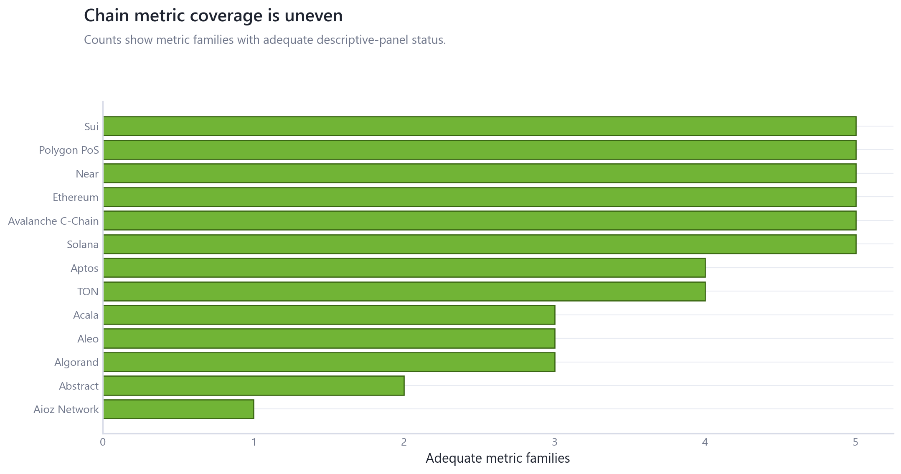
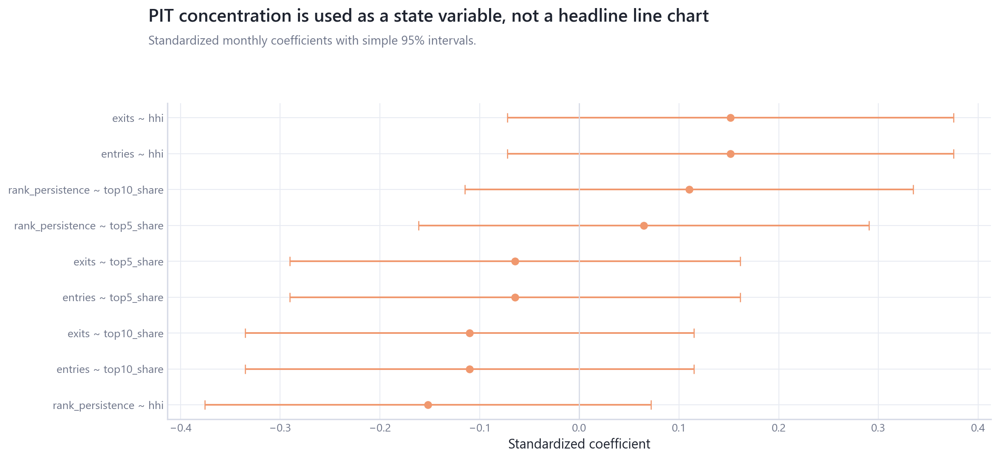

# 07_chain_fundamentals_sector_dynamics: Chain Fundamentals and Sector Dynamics

## Overview

This module combines chain-fundamental coverage with point-in-time sector/market-structure state variables, without promoting raw concentration charts.

## Questions Investigated

- Which chain metrics and chains have enough coverage for descriptive panel work?
- How can PIT concentration/turnover variables be used as state variables without becoming headline raw charts?

## Data, Assets, and Sample

| artifact                                       |   rows | sample                              | coverage rule                              |
|:-----------------------------------------------|-------:|:------------------------------------|:-------------------------------------------|
| tables/asset_identity_audit.csv                |     16 | rows=16                             | module-specific matched sample             |
| tables/chain_activity_associations.csv         |      1 | rows=1                              | module-specific matched sample             |
| tables/chain_fundamental_panel_summary.csv     |     50 | 2015-07-30 to 2024-10-25, rows=50   | module-specific matched sample             |
| tables/pit_concentration.csv                   |     78 | 2020-01-31 to 2026-06-16, rows=78   | monthly point-in-time state variables only |
| tables/pit_market_structure_monthly.csv        |   7800 | 2020-01-31 to 2026-06-16, rows=7800 | monthly point-in-time state variables only |
| tables/pit_market_structure_summary.csv        |     78 | 2020-01-31 to 2026-06-16, rows=78   | monthly point-in-time state variables only |
| tables/pit_period_comparison.csv               |      5 | rows=5                              | monthly point-in-time state variables only |
| tables/pit_state_relationship_coefficients.csv |      9 | rows=9                              | monthly point-in-time state variables only |
| tables/pit_turnover.csv                        |     77 | rows=77                             | monthly point-in-time state variables only |

## Methodologies and Calculations

| method                 | calculation                                                                         |
|:-----------------------|:------------------------------------------------------------------------------------|
| Coverage audit         | chain metrics are counted by chain and metric family before relationship claims.    |
| PIT state coefficients | monthly concentration and turnover are modeled as standardized state relationships. |

## Formulas

$z(x)=(x-\bar x)/\sigma_x$.

$z(y_t)=\alpha+\beta z(state_t)+u_t$ for monthly PIT state relationships.

## Summary of Results

| finding                       | estimate                   | interval                   | N/sample                          | interpretation                                                     | sensitivity                                                    |
|:------------------------------|:---------------------------|:---------------------------|:----------------------------------|:-------------------------------------------------------------------|:---------------------------------------------------------------|
| Chain and sector/PIT coverage | 5 metrics across 13 chains | coverage-first panel audit | 2015-07-30 to 2024-10-25, rows=50 | Chain evidence is promoted only after mapping and coverage checks. | coverage threshold, chain mapping, monthly PIT state variables |

## Analytical Results and Visualizations



Metric-family coverage is summarized by chain to show where panel claims remain thin.



PIT concentration and turnover enter as state-model coefficients, not as raw headline HHI or rank-persistence lines.


Chain coverage is shown before interpretation; adequate coverage does not itself establish a relationship.

## Robustness and Sensitivity

Sensitivity dimensions are: coverage threshold, chain mapping, monthly state model, partial period. Tables report matched samples, frequencies, and timing conventions where available.

## Interpretation

Chain and PIT outputs are coverage and state diagnostics. PIT variables support monthly state analysis, not daily constituent-performance claims.

## Limitations

Panel depth differs by metric/chain; monthly PIT snapshots have partial-month and survivorship constraints.

## Reproduce This Module

```bash
uv run python scripts/run_research.py --module 07_chain_fundamentals_sector_dynamics
uv run python scripts/build_research_figures.py --module 07_chain_fundamentals_sector_dynamics
uv run python scripts/check_research_surface.py --module 07_chain_fundamentals_sector_dynamics
```

## Files and Code

- [`asset_identity_audit.csv`](tables/asset_identity_audit.csv)
- [`chain_activity_associations.csv`](tables/chain_activity_associations.csv)
- [`chain_fundamental_panel_summary.csv`](tables/chain_fundamental_panel_summary.csv)
- [`claims.csv`](tables/claims.csv)
- [`pit_concentration.csv`](tables/pit_concentration.csv)
- [`pit_market_structure_monthly.csv`](tables/pit_market_structure_monthly.csv)
- [`pit_market_structure_summary.csv`](tables/pit_market_structure_summary.csv)
- [`pit_period_comparison.csv`](tables/pit_period_comparison.csv)
- [`pit_state_relationship_coefficients.csv`](tables/pit_state_relationship_coefficients.csv)
- [`pit_turnover.csv`](tables/pit_turnover.csv)

- [Methodology](methodology.md)
- [Findings](findings.md)
- [Interpretation](interpretation.md)
- [Limitations](limitations.md)
- Code: `src/cqresearch/research/analytical_modules.py`
