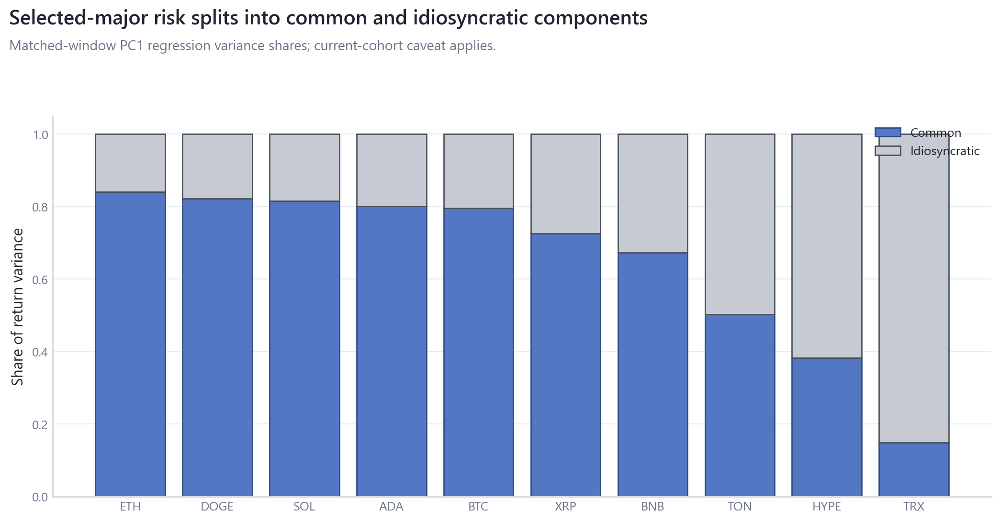
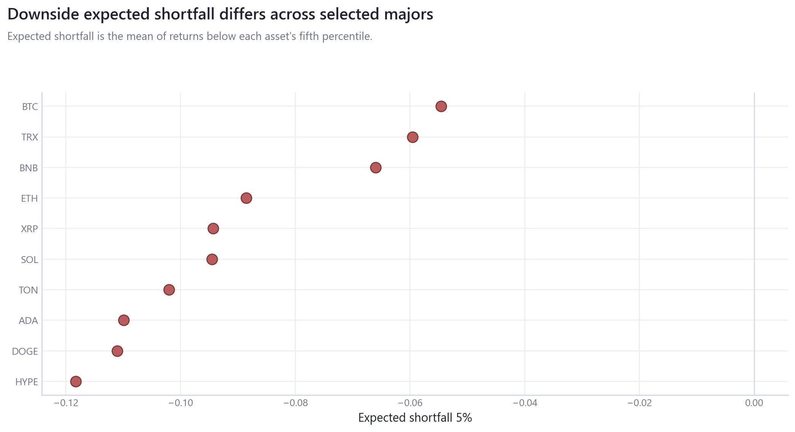
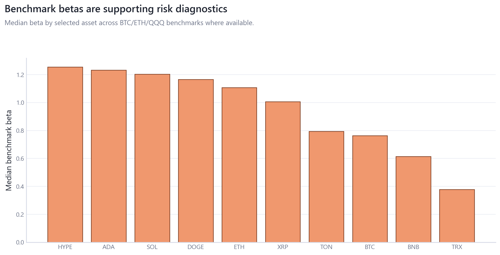

# 08_relative_asset_risk_factor_structure: Relative Asset Risk and Factor Structure

## Overview

This module replaces the basic selected-major volatility/drawdown scatter with matched-window common-factor, idiosyncratic-risk, downside-beta, and expected-shortfall diagnostics.

## Questions Investigated

- How much selected-major risk is common crypto factor versus asset-specific residual risk?
- Which assets have larger downside expected shortfall and downside beta on the matched current-cohort window?

## Data, Assets, and Sample

| artifact                                            |   rows | sample                            | coverage rule                                |
|:----------------------------------------------------|-------:|:----------------------------------|:---------------------------------------------|
| tables/asset_identity_audit.csv                     |     16 | rows=16                           | module-specific matched sample               |
| tables/asset_taxonomy.csv                           |    200 | rows=200                          | module-specific matched sample               |
| tables/downside_expected_shortfall.csv              |     10 | 2024-11-30 to 2026-06-16, n=10    | module-specific matched sample               |
| tables/relative_factor_decomposition.csv            |     10 | 2024-11-30 to 2026-06-16, n=10    | matched current-cohort selected-major window |
| tables/selected_major_betas.csv                     |     30 | rows=30                           | matched current-cohort selected-major window |
| tables/selected_major_comparable_window_metrics.csv |     10 | rows=10                           | matched current-cohort selected-major window |
| tables/selected_major_coverage.csv                  |     10 | 2022-12-31 to 2024-11-29, rows=10 | matched current-cohort selected-major window |
| tables/selected_major_risk_metrics.csv              |     10 | 2023-01-01 to 2024-11-30, rows=10 | matched current-cohort selected-major window |

## Methodologies and Calculations

| method                             | calculation                                                                         |
|:-----------------------------------|:------------------------------------------------------------------------------------|
| Common/idiosyncratic decomposition | each asset return is regressed on PC1 scores from the matched selected-major panel. |
| Downside risk                      | expected shortfall and BTC-tail downside beta are computed on matched rows.         |

## Formulas

$r_{i,t}=\alpha_i+\beta_i PC1_t+\epsilon_{i,t}$.

$ES_i(5\%)=E[r_i\mid r_i\le Q_i(0.05)]$.

## Summary of Results

| finding                                         | estimate                           | interval                            | N/sample                       | interpretation                                                                    | sensitivity                                               |
|:------------------------------------------------|:-----------------------------------|:------------------------------------|:-------------------------------|:----------------------------------------------------------------------------------|:----------------------------------------------------------|
| Common versus idiosyncratic selected-major risk | median common variance share=76.2% | matched-window factor decomposition | 2024-11-30 to 2026-06-16, n=10 | Selected-major comparisons are factor/risk diagnostics, not investability claims. | matched window, downside threshold, BTC/ETH/PC benchmarks |

## Analytical Results and Visualizations



This replaces the basic volatility/drawdown scatter with a matched-window common-versus-idiosyncratic decomposition.



Expected shortfall and downside beta are shown as risk measures with direct asset labels.



Benchmark betas are supporting context and remain descriptive.

## Robustness and Sensitivity

Sensitivity dimensions are: matched window, benchmark, tail threshold, short-history flags. Tables report matched samples, frequencies, and timing conventions where available.

## Interpretation

Relative asset risk is descriptive and coverage-aware; it is not an investability or ranking claim.

## Limitations

Current-cohort data is survivorship-biased and HYPE/short-history assets limit cross-cycle comparability.

## Reproduce This Module

```bash
uv run python scripts/run_research.py --module 08_relative_asset_risk_factor_structure
uv run python scripts/build_research_figures.py --module 08_relative_asset_risk_factor_structure
uv run python scripts/check_research_surface.py --module 08_relative_asset_risk_factor_structure
```

## Files and Code

- [`asset_identity_audit.csv`](tables/asset_identity_audit.csv)
- [`asset_taxonomy.csv`](tables/asset_taxonomy.csv)
- [`claims.csv`](tables/claims.csv)
- [`downside_expected_shortfall.csv`](tables/downside_expected_shortfall.csv)
- [`relative_factor_decomposition.csv`](tables/relative_factor_decomposition.csv)
- [`selected_major_betas.csv`](tables/selected_major_betas.csv)
- [`selected_major_comparable_window_metrics.csv`](tables/selected_major_comparable_window_metrics.csv)
- [`selected_major_coverage.csv`](tables/selected_major_coverage.csv)
- [`selected_major_risk_metrics.csv`](tables/selected_major_risk_metrics.csv)

- [Methodology](methodology.md)
- [Findings](findings.md)
- [Interpretation](interpretation.md)
- [Limitations](limitations.md)
- Code: `src/cqresearch/research/analytical_modules.py`
