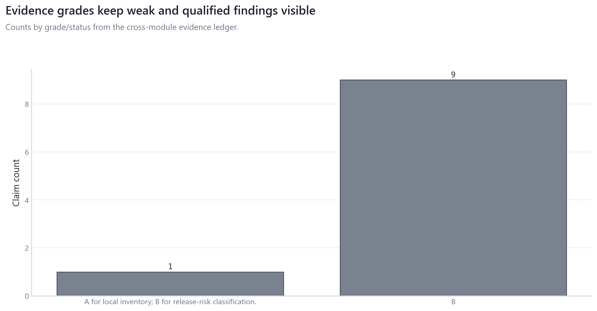
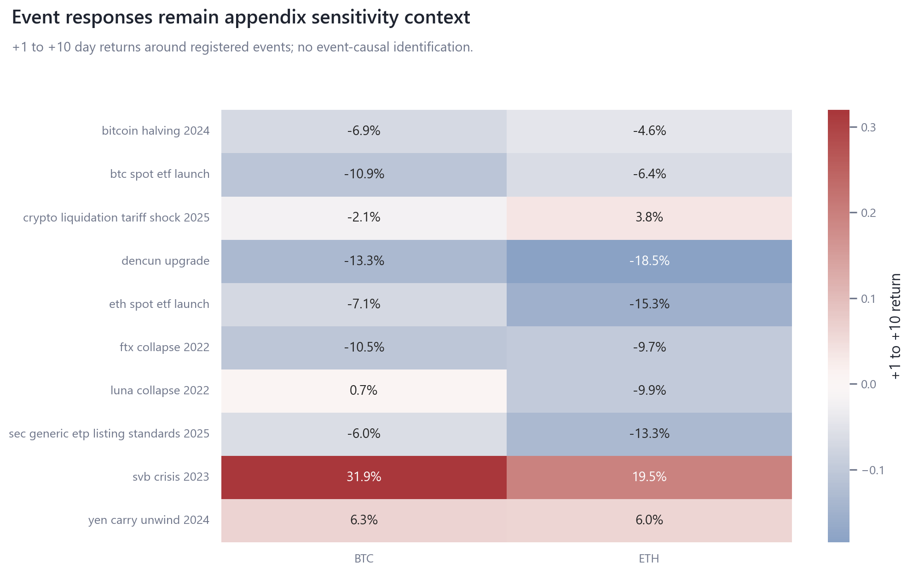

# 09_event_stress_cross_module_synthesis: Event Stress and Cross-Module Synthesis

## Overview

This module combines event-window stress diagnostics with the cross-module evidence ledger and final claim-quality synthesis.

## Questions Investigated

- How do registered event windows compare with empirical placebo windows?
- Which findings remain strongest after sample, uncertainty, measurement-risk, and limitation review?

## Data, Assets, and Sample

| artifact                                         |   rows | sample                            | coverage rule                  |
|:-------------------------------------------------|-------:|:----------------------------------|:-------------------------------|
| tables/claim_inventory.csv                       |     12 | rows=12                           | module-specific matched sample |
| tables/event_atlas.csv                           |     10 | 2022-05-09 to 2025-10-10, rows=10 | module-specific matched sample |
| tables/event_inference.csv                       |     20 | rows=20                           | module-specific matched sample |
| tables/event_response_matrix.csv                 |     20 | rows=20                           | module-specific matched sample |
| tables/evidence_ledger.csv                       |     10 | rows=10                           | module-specific matched sample |
| tables/evidence_map.csv                          |      9 | rows=9                            | module-specific matched sample |
| tables/fdr_adjusted_inference.csv                |    186 | 2020-01-03 to 2026-04-12, n=186   | module-specific matched sample |
| tables/local_window_correlation_distribution.csv |      4 | rows=4                            | module-specific matched sample |
| tables/provider_data_disposition.csv             |      8 | 1947-01-01 to 2024-01-11, rows=8  | module-specific matched sample |
| tables/robustness_summary.csv                    |      9 | rows=9                            | module-specific matched sample |

## Methodologies and Calculations

| method             | calculation                                                                            |
|:-------------------|:---------------------------------------------------------------------------------------|
| Event windows      | fixed +1 through +10 windows are compared with empirical placebo blocks.               |
| Evidence synthesis | claim rows are graded by source depth, uncertainty, measurement risk, and limitations. |

## Formulas

$R_{event}=\sum_{h=1}^{10}r_{t+h}$, excluding event day.

$q$-values and evidence grades are synthesis diagnostics, not causal identification.

## Summary of Results

| finding                                    | estimate                             | interval                                      | N/sample   | interpretation                                                                                | sensitivity                                              |
|:-------------------------------------------|:-------------------------------------|:----------------------------------------------|:-----------|:----------------------------------------------------------------------------------------------|:---------------------------------------------------------|
| Event and cross-module evidence discipline | median eligible placebo windows=2007 | empirical placebo windows and evidence ledger | rows=20    | Event outputs remain appendix/stress diagnostics; synthesis ranks claims by evidence quality. | event window, placebo eligibility, FDR, measurement risk |

## Analytical Results and Visualizations



Evidence-grade counts are crossed with measurement-risk flags to make weak/null findings visible.



Event responses are kept in the appendix/gallery role and compared with placebo windows.


Synthesis summarizes source depth and claim evidence without reducing everything to one score.

## Robustness and Sensitivity

Sensitivity dimensions are: window length, placebo eligibility, FDR, measurement risk, claim grade. Tables report matched samples, frequencies, and timing conventions where available.

## Interpretation

Event and synthesis outputs are final review instruments. They preserve weak/null findings instead of using specification search.

## Limitations

Event windows are not an identification design; synthesis quality depends on upstream modules.

## Reproduce This Module

```bash
uv run python scripts/run_research.py --module 09_event_stress_cross_module_synthesis
uv run python scripts/build_research_figures.py --module 09_event_stress_cross_module_synthesis
uv run python scripts/check_research_surface.py --module 09_event_stress_cross_module_synthesis
```

## Files and Code

- [`claim_inventory.csv`](tables/claim_inventory.csv)
- [`claims.csv`](tables/claims.csv)
- [`event_atlas.csv`](tables/event_atlas.csv)
- [`event_inference.csv`](tables/event_inference.csv)
- [`event_response_matrix.csv`](tables/event_response_matrix.csv)
- [`evidence_ledger.csv`](tables/evidence_ledger.csv)
- [`evidence_map.csv`](tables/evidence_map.csv)
- [`fdr_adjusted_inference.csv`](tables/fdr_adjusted_inference.csv)
- [`local_window_correlation_distribution.csv`](tables/local_window_correlation_distribution.csv)
- [`provider_data_disposition.csv`](tables/provider_data_disposition.csv)
- [`robustness_summary.csv`](tables/robustness_summary.csv)

- [Methodology](methodology.md)
- [Findings](findings.md)
- [Interpretation](interpretation.md)
- [Limitations](limitations.md)
- Code: `src/cqresearch/research/analytical_modules.py`
